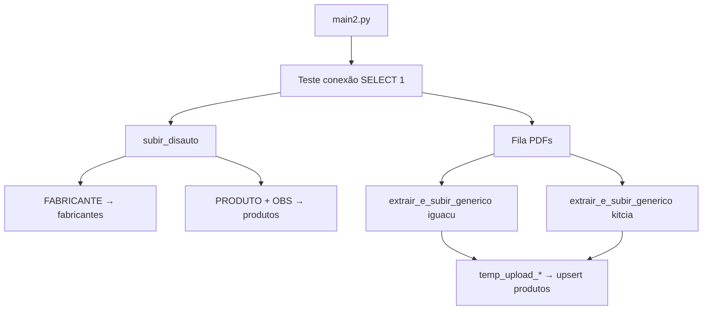

# Histórico do Projeto — Pipeline de Catálogos de Autopeças

Documento vivo com o que foi feito, como executar e decisões técnicas.  
**Projeto Supabase:** `oxqojsmlbptmofmhyfea` · URL: `https://oxqojsmlbptmofmhyfea.supabase.co`

**MVP 100 catálogos (WhatsApp HD):** ver `MVP_VALIDACAO.md` · **Roadmap produto:** `docs/ROADMAP_MVP.md` · **UX balcão:** `docs/UX_MELHORIAS_BALCAO.md` · Escala: `ARQUITETURA_ESCALA.md`

---

## 1. Objetivo

Consolidar mais de 300 catálogos de autopeças (PDFs e planilhas) em um banco PostgreSQL no Supabase, com:

- Tabelas normalizadas: `fabricantes`, `produtos`, `referencias_cruzadas`
- Ingestão em lote via **staging tables** + `INSERT ... ON CONFLICT`
- Orquestração centralizada em **`main2.py`** (o `main.py` permanece intocado como fallback)

---

## 2. Estrutura do repositório

```text
Projeto Leo/
├── src/                    # App web Next.js 15 (App Router)
│   ├── app/                # rotas (login + área autenticada)
│   ├── components/         # UI (shell, busca, orçamento, catálogos…)
│   ├── lib/                # Supabase, actions, whatsapp, cart, loja
│   └── middleware.ts       # refresh de sessão Supabase SSR
├── catalogos/              # entrada (PDF/XLSX aguardando)
├── catalogos_extraidos/    # processados com sucesso
├── catalogos_erro/         # falhas (opcional)
├── scripts/                # todo o código Python
│   ├── main2.py            # orquestrador MVP
│   ├── catalogo_utils.py   # fila por pasta + inferência de layout
│   └── project_paths.py    # caminhos da raiz do projeto
├── sql/                    # schema tenant + RLS
├── docs/                   # roadmap, UX, validação
├── .env.example            # placeholders (sem secrets reais)
└── README.md
```

| Script | Função |
|--------|--------|
| `scripts/main2.py` | Lê `catalogos/`, envia à nuvem, move para `catalogos_extraidos/` |
| `scripts/catalog_configs.py` | Regras de parsing por layout |
| `scripts/storage_uploader.py` | Imagens → Supabase Storage (quota 50 MB) |
| `scripts/main.py` | Pipeline legado (não alterar) |

### Dados

Arquivos de catálogo ficam em **`catalogos/`** (não mais na raiz do projeto).

---

## 3. Schema do banco (aplicado em 20/05/2026)

Migration MCP: `create_catalog_tables`

### Tabelas

**`fabricantes`**

- `id`, `nome_fabricante`, `origem_catalogo`, `codigo_original_fornecedor`
- `UNIQUE (nome_fabricante, origem_catalogo)`

**`produtos`**

- `codigo_produto_interno`, `numero_produto`, `descricao`, `unidade`, `foto_url`, `observacoes`, `origem_catalogo`, `fabricante_id`
- `UNIQUE (codigo_produto_interno, origem_catalogo)`
- FK → `fabricantes(id)`

**`referencias_cruzadas`**

- `produto_id`, `numero_referencia`, `fabricante_referencia`
- FK → `produtos(id)` (ainda não populada pelos extratores atuais)

### Correção aplicada no DDL

No `schema.sql` original havia typo na constraint: `origin_catalogo` → corrigido para **`origem_catalogo`**.

### Segurança (RLS)

O advisor do Supabase reportou **RLS desabilitado** nas três tabelas. Para API pública com anon key, avalie políticas antes de habilitar:

```sql
ALTER TABLE public.fabricantes ENABLE ROW LEVEL SECURITY;
ALTER TABLE public.produtos ENABLE ROW LEVEL SECURITY;
ALTER TABLE public.referencias_cruzadas ENABLE ROW LEVEL SECURITY;
-- Em seguida, crie políticas adequadas ao seu caso de uso.
```

---

## 4. Sessão de trabalho — 20/05/2026

### Passo 1 — Schema no Supabase ✅

- Aplicado via MCP `apply_migration` (equivalente a rodar `schema.sql`)
- Verificado com `list_tables`: 3 tabelas criadas, 0 linhas

### Passo 2 — Revisão e ajustes de código ✅

| Mudança | Motivo |
|---------|--------|
| `db_connection.py` lê env vars | Remover senha/host hardcoded; suportar `DATABASE_URL` |
| `main2.py` orquestra Disauto + PDFs | Antes só rodava PDFs; faltava Disauto |
| `extractor_engine.py` aceita `engine` | Reutilizar uma conexão na esteira |
| `extract_disauto.py` lê `.xlsx` | CSVs não estavam na pasta; só o Excel |

### Passo 3 — Dependências ✅

Ambiente virtual local:

```bash
cd "/Users/vinicius/Documents/Projeto Leo"
python3 -m venv .venv
source .venv/bin/activate
pip install -r requirements.txt
```

Pacotes: `pandas`, `sqlalchemy`, `psycopg2-binary`, `pdfplumber`, `tqdm`, `openpyxl`.

### Passo 4 — Execução do `main2.py` ✅ (21/05/2026)

Primeiro teste completo (~98s). Correções aplicadas na sessão:

- `.env`: URI direta `db.*.supabase.co` não resolve em IPv4 nesta rede → migrado para **Session pooler** `aws-1-sa-east-1.pooler.supabase.com`
- `extract_disauto.py`: `.str.strip()` e coluna `fabricante_id` após merge

**Resultados no Supabase:**

| origem_catalogo | produtos |
|-----------------|----------|
| disauto | 48.555 |
| iguacu | 4 |
| kitcia | 1.178 |
| **fabricantes** | **1.626** |

**Atualização 21/05:** Iguaçu reprocessado com regex → **675** códigos únicos (~679 linhas no banco).

---

## 11. Imagens no Supabase Storage (quota 50 MB)

**Disauto/Excel:** fotos **ignoradas** (sem upload a partir do xlsx).

**PDFs:** extraídas, redimensionadas e enviadas ao bucket **`produtos-imagens`** (criado em 21/05/2026).

### Compressão (plano free)

| Variável `.env` | Padrão | Função |
|-----------------|--------|--------|
| `STORAGE_QUOTA_MB` | 50 | Para ao atingir o teto |
| `IMAGE_MAX_SIDE` | 320 | Maior lado (px) |
| `IMAGE_JPEG_QUALITY` | 58 | Qualidade JPEG |

### Primeiro upload (PDFs)

| Catálogo | Imagens | ~Tamanho |
|----------|---------|----------|
| Iguaçu | 688 | 1,5 MB |
| Kit&Cia | 2.701 | 3,4 MB |
| **Total** | **~3.389** | **~5 MB** (sobra na quota) |

URL: `https://oxqojsmlbptmofmhyfea.supabase.co/storage/v1/object/public/produtos-imagens/iguacu/pdf/p006_01.jpg`

Vínculo automático código ↔ foto na mesma página: passo futuro.

**Como rodar:**

```bash
cd "/Users/vinicius/Documents/Projeto Leo"
cp .env.example .env
# Edite .env com a senha do banco (Settings → Database no Supabase)

export $(grep -v '^#' .env | xargs)   # ou: source um script que exporte as vars
source .venv/bin/activate
python main2.py
```

Senha: Supabase Dashboard → **Project Settings → Database** → Database password (ou Connection string URI).

O `db_connection.py` carrega automaticamente um arquivo `.env` na raiz do projeto (se existir), sem precisar de `python-dotenv`.

---

## 5. Fluxo do `main2.py`



Ordem de execução:

1. **Disauto** — fabricantes e produtos completos (com `fabricante_id`)
2. **Iguaçu** — PDF, regras em `catalog_configs['iguacu']`
3. **Kit&Cia** — PDF, regras em `catalog_configs['kitcia']`

Erros em um catálogo **não interrompem** a fila (try/continue).

---

## 6. Configuração de catálogos PDF

Arquivo: `catalog_configs.py`

| Chave | Origem | Regra principal |
|-------|--------|-----------------|
| `iguacu` | `iguacu` | Regex de código `\d{3}\.\d{4}` (ex: `201.0813`) + seção do produto |
| `kitcia` | `kitcia` | Linhas que começam com número (`apenas_numeros_no_inicio`) |

Para novo catálogo: analisar amostra do PDF, adicionar entrada no dicionário e incluir `{"path": "...", "config": "..."}` na fila do `main2.py`.

---

## 7. Padrão de ingestão (staging)

1. Extrair dados → `pandas.DataFrame`
2. `df.to_sql('temp_upload_<origem>', engine, if_exists='replace')`
3. `INSERT INTO produtos ... ON CONFLICT DO UPDATE`
4. `DROP TABLE temp_upload_<origem>`

Disauto usa o mesmo padrão com `fab_temp_disauto` e `prod_temp_disauto`.

---

## 8. MCP Supabase (Cursor)

Configurado em `~/.cursor/mcp.json`:

```json
"url": "https://mcp.supabase.com/mcp?project_ref=oxqojsmlbptmofmhyfea"
```

Ferramentas usadas nesta sessão:

- `apply_migration` — DDL
- `list_tables` — validação do schema

O MCP **não substitui** a senha do Postgres para o Python: o `main2.py` conecta via SQLAlchemy/psycopg2 com credenciais locais.

---

## 9. Próximos passos sugeridos

- [ ] Configurar `.env` e rodar `main2.py` até o fim
- [ ] Conferir contagens: `SELECT origem_catalogo, COUNT(*) FROM produtos GROUP BY 1`
- [ ] Popular `referencias_cruzadas` (aba `REFERENCIACRUZADA` no xlsx Disauto)
- [ ] Habilitar RLS + políticas se houver exposição via API
- [ ] Adicionar novos catálogos em `catalog_configs.py` + fila do `main2.py`
- [ ] Considerar `python-dotenv` para carregar `.env` automaticamente

---

## 10. Changelog

| Data | Ação |
|------|------|
| 2026-05-20 | Migration `create_catalog_tables` no Supabase |
| 2026-05-20 | Fix typo `origin_catalogo` → `origem_catalogo` em `schema.sql` |
| 2026-05-20 | `main2.py` unificado (Disauto + PDFs) |
| 2026-05-20 | `db_connection.py` via variáveis de ambiente |
| 2026-05-20 | `extract_disauto.py` suporte a `catalogo_disauto.xlsx` |
| 2026-05-20 | `.venv` + `requirements.txt` + `.env.example` |
| 2026-05-20 | Criação deste `PROJETO_HISTORICO.md` |
| 2026-05-21 | Primeiro `main2.py` OK; pooler IPv4; fixes Disauto; 49.737 produtos |
| 2026-05-21 | Iguaçu: regex `201.xxxx` → 675 produtos; `storage_uploader.py` |
| 2026-05-21 | Bucket `produtos-imagens`; ~3,4k fotos PDF comprimidas (~5 MB) |
| 2026-05-21 | MVP: `catalogos`+`ingestao_jobs`, fila JSON, cap imagens/catálogo |
| 2026-05-21 | Pastas: `scripts/`, `catalogos/`, `catalogos_extraidos/`; main2 por pasta |
| 2026-07-02 | **App web:** code review, correções de bugs/segurança, middleware, testes — ver § 12 |

---

## 12. App Web — sessão 02/07/2026

### Contexto

Revisão profunda do app Next.js (`src/`) após o MVP 1.0 de telas. Objetivo: corrigir bugs bloqueadores, endurecer segurança/sessão, alinhar documentação e registrar decisões de produto antes de implementar as melhorias de UX do balcão (`docs/UX_MELHORIAS_BALCAO.md` — **futuro**, não nesta sessão).

**Stack validada:** Next.js `15.5.19` + React 19 + Supabase SSR + Tailwind 4.

### Decisões de produto (alinhadas com o autor)

| Tópico | Decisão | Motivo |
|--------|---------|--------|
| `.env.example` | Chaves reais **não** foram commitadas; arquivo corrigido com placeholders | Evitar vazamento; pipeline e app usam vars diferentes |
| Multi-loja | **Modelo já é multi-tenant** (`lojas` + `membros_loja` + RLS); UX de **1 loja por usuário** no MVP 1.0 | Várias revendas podem usar o mesmo catálogo central; troca de loja fica para MVP 2.0+ |
| Carrinho de orçamento | Permanece em **`localStorage`** no MVP 1.0 | Menos complexidade; sync server-side documentada no `ROADMAP_MVP.md` § 3 |
| WhatsApp suporte | Fallback **`5561998117002`** quando loja sem telefone | Card "Suporte Técnico" no dashboard sempre funcional |
| Busca por relevância | Melhoria incremental: **normalização de código** (tolerância a `.`, `-`, espaço); FTS real fica no roadmap | Caso típico de balcão: `201.0813` vs `2010813` |
| UX balcão | Pesquisa em `docs/UX_MELHORIAS_BALCAO.md` — implementação **posterior** | Foco desta sessão: código estável, não redesign |

### Correções aplicadas

#### Segurança e sessão

| Mudança | Arquivo(s) | Motivo |
|---------|------------|--------|
| **`src/middleware.ts` criado (runtime Node.js)** | `middleware.ts` → `lib/supabase/proxy.ts`; `next.config.ts` | `updateSession` existia mas não estava ligado. **Atenção:** o middleware foi removido em commits anteriores porque o **edge runtime** falhava com o Supabase SSR na Vercel (`MIDDLEWARE_INVOCATION_FAILED`). Reintroduzido com `runtime: "nodejs"` + `experimental.nodeMiddleware: true`, que evita o edge. Confirmado no build: `middleware-manifest.json` vazio e artefato `.next/server/middleware.js` (Node) |
| **`.env.example` com placeholders** | `.env.example` | Separar vars públicas (`NEXT_PUBLIC_*`) das do pipeline (`SERVICE_ROLE_KEY`, `DATABASE_URL` comentadas) |
| **Guard de dono no upload** | `catalogos/upload/page.tsx` + `components/catalogos/upload-form.tsx` | Só `papel === "dono"` vê o formulário; RLS já bloqueava, mas UX evitava página inútil |
| **Validação de tamanho de arquivo** | `upload-form.tsx` | UI prometia 50 MB; código não validava |

**Impacto do middleware / decisão de runtime:** Next instalado é `15.5.19`. A primeira tentativa (edge, padrão) gerava `ƒ Middleware` no build — exatamente o caminho que quebrou antes na Vercel. Trocado para **runtime Node.js** via `runtime: "nodejs"` no middleware + `experimental.nodeMiddleware: true` no `next.config.ts`. O flag é aceito em runtime pelo Next 15.5.19 (aparece em "Experiments ✓ nodeMiddleware"), mas ainda não está tipado em `ExperimentalConfig` — daí o `@ts-expect-error` no `next.config.ts` e um warning benigno de schema no build. **Risco residual:** `nodeMiddleware` é experimental; validar no primeiro deploy da Vercel. Se falhar, alternativa é remover o middleware e manter proteção via `(app)/layout.tsx`.

#### Bugs

| Bug | Correção | Arquivo |
|-----|----------|---------|
| Query usava coluna `codigo` inexistente | Trocado para `codigo_produto_interno` | `clientes/[id]/page.tsx` |
| Orçamento órfão se insert de itens falha | Rollback manual: `delete` no cabeçalho | `lib/actions/orcamentos.ts` |
| `clienteId` sem checagem de tenant | Valida `clientes.id` + `loja_id` antes de vincular | `lib/actions/orcamentos.ts` |
| Quantidade/preço inválidos | Saneamento: qtd ≥ 1, preço ≥ 0 | `lib/actions/orcamentos.ts` |
| WhatsApp dashboard sem DDI `55` | Helpers centralizados + fallback padrão | `lib/whatsapp.ts`, `page.tsx` |
| Links `wa.me` duplicados no CRM | Uso de `buildContatoLojaUrl` | `clientes/page.tsx`, `clientes/[id]/page.tsx` |
| `eslint.config.mjs` quebrado | Reescrito com `FlatCompat` (ESLint 9) | `eslint.config.mjs` |
| `getContextoLoja` não determinístico | `.order("loja_id")` antes de `.limit(1)` | `lib/loja.ts` |

#### Busca

- Função `apenasCodigo()` remove separadores (`.`, `-`, espaço, `/`) para match adicional em `codigo_produto_interno`, `numero_produto` e `referencias_cruzadas`.
- Ranking por relevância textual (FTS) permanece no roadmap; esta melhoria cobre o caso de código digitado com formatação diferente.

#### Acessibilidade (quick wins)

| Mudança | Onde | Motivo |
|---------|------|--------|
| Removido `opacity-0 group-hover:opacity-100` | `busca`, `historico`, `clientes` | Ações invisíveis para teclado e leitores de tela |
| `aria-label` em botões só-ícone | `busca`, `clientes`, `whatsapp-row-button` | WCAG: ícone sem texto acessível |

**Pendente (UX doc):** layout mobile (sidebar fixa `w-64`), modais com focus trap, busca reestruturada — ver `docs/UX_MELHORIAS_BALCAO.md` Fases A–F.

#### Testes

- **Vitest** adicionado (`vitest.config.ts`, `npm test`).
- **`src/lib/whatsapp.test.ts`**: 13 testes cobrindo normalização de telefone, URLs, mensagens de produto/orçamento.
- Primeira suíte automatizada do app web.

#### Documentação

| Arquivo | O que mudou |
|---------|-------------|
| `README.md` | Reescrito para estrutura real na raiz (removido monorepo `app/` e `vercel.json`) |
| `docs/ROADMAP_MVP.md` | Nota explícita: carrinho em `localStorage` no 1.0; persistência server-side no 2.0 |
| `docs/UX_MELHORIAS_BALCAO.md` | Criado (pesquisa UX balcão — referência futura) |
| `PROJETO_HISTORICO.md` | Esta seção § 12 |

### Arquivos novos nesta sessão

```
src/middleware.ts
src/components/catalogos/upload-form.tsx
src/lib/whatsapp.test.ts
vitest.config.ts
docs/UX_MELHORIAS_BALCAO.md
```

### Como validar localmente

```bash
npm install
cp .env.example .env.local   # preencher NEXT_PUBLIC_SUPABASE_*
npm run lint                 # 0 erros (2 warnings de Google Fonts pré-existentes)
npm test                     # 13 testes whatsapp
npm run build                # inclui Middleware compilado
npm run dev
```

### Próximos passos sugeridos (app web)

- [ ] Implementar quick wins de UX (`docs/UX_MELHORIAS_BALCAO.md` § 5 — Fase A)
- [ ] Testes das server actions (`orcamentos`, `clientes`) com Supabase local ou mocks
- [ ] Layout responsivo (sidebar colapsável, barras fixas sem `left-64` em mobile)
- [ ] RPC Postgres transacional para `salvarOrcamento` (substituir rollback manual)
- [ ] Full-text search no Postgres ou Meilisearch (ranking real de relevância)
- [ ] UI de troca de loja (quando usuário pertencer a múltiplas revendas)

### Changelog app web (detalhe)

| Data | Arquivo / área | Ação |
|------|----------------|------|
| 2026-07-02 | `middleware.ts` | Sessão Supabase SSR + guards de rota |
| 2026-07-02 | `clientes/[id]/page.tsx` | Fix `codigo_produto_interno` |
| 2026-07-02 | `orcamentos.ts` | Validação cliente, saneamento itens, rollback |
| 2026-07-02 | `whatsapp.ts` | `WHATSAPP_PADRAO`, normalização, `buildContatoLojaUrl` |
| 2026-07-02 | `busca/page.tsx` | Normalização de código na busca |
| 2026-07-02 | `catalogos/upload` | Guard dono + componente client extraído |
| 2026-07-02 | `eslint.config.mjs` | FlatCompat ESLint 9 |
| 2026-07-02 | `whatsapp.test.ts` | 13 testes unitários |
| 2026-07-02 | `busca`, `historico`, `clientes` | Acessibilidade: ações sempre visíveis |

### UX balcão — quick wins P0 (02/07/2026)

Implementação das prioridades P0 de `docs/UX_MELHORIAS_BALCAO.md` para dar "cara de software de verdade", sem tocar em auth/middleware/server actions.

| Item (doc) | O que foi feito | Arquivos |
|------------|-----------------|----------|
| Shell responsivo | Sidebar vira **drawer** no mobile (hambúrguer no header, backdrop, fecha no Escape/rota); fixa em `lg+`. `ml-64`/`left-64` → `lg:`. Estado coordenado por client wrapper `NavShell` (layout segue server component) | `components/shell/nav-shell.tsx` (novo), `sidebar.tsx`, `header.tsx`, `footer.tsx`, `(app)/layout.tsx`, `produto/acoes.tsx`, `orcamento/barra-acoes.tsx` |
| Linha de busca (§4.1) | Título (descrição) + código destacado + chips de referências cruzadas; coluna `Fabricante` vazia → **Aplicação/Referências**; botão **+ Orçamento** na linha; selo "via referência"; placeholder de foto discreto; colunas secundárias colapsam no mobile | `busca/page.tsx`, `components/busca/adicionar-orcamento-button.tsx` (novo) |
| Detalhe do produto (§4.2) | Códigos em **chips copiáveis**; referências como chips; seção Aplicações com placeholder intencional | `produtos/[id]/page.tsx`, `components/produto/codigo-chip.tsx` (novo) |
| WhatsApp (§4.5) | **Prévia editável** (`<textarea>`) no modal de orçamento e de produto; envio usa o texto editado (`buildWhatsAppUrl`); "Enviar WhatsApp" como ação primária | `orcamento/barra-acoes.tsx`, `produto/acoes.tsx` |
| P1 | Estado vazio da busca com sugestões (remover hífens, só código, suporte); login/footer sem `href="#"` quebrado | `busca/page.tsx`, `login/page.tsx`, `footer.tsx` |

Validação: `npm run build` ✓, `npm test` ✓ 13/13, `npm run lint` ✓ 0 erros.

**Pendente (próximo incremento UX):** focus trap real nos modais e no drawer; match exato priorizado + autocomplete/atalhos de teclado (`/`, `A`, `W`) na busca; dados de aplicação por veículo e estoque/preço (MVP 2.0).

### Redesign visual "SaaS moderno" (03/07/2026)

Feedback do dono: a UI ainda tinha "cara de software datado" (navy chapado + cinzas), lembrando o ERP legado (SS Plus v12). Redesign para estética moderna (referências Linear/Vercel/Stripe), mantendo densidade operacional e toda a funcionalidade.

| Área | Mudança |
|------|---------|
| Paleta (`globals.css` `@theme`) | Neutros **slate**; primária **azul `#2563eb`** (era navy `#002046`); acento **esmeralda `#059669`** (CTA/WhatsApp — aceno sutil ao verde do SS Plus); tertiary slate; error moderno. Nomes dos tokens preservados → propaga por todo o app |
| Sidebar | **Slate escuro `#0f172a`** (não usa mais `bg-primary`), item ativo com realce esmeralda + `aria-current`, badge do carrinho esmeralda |
| Componentes/telas | `rounded-xl` em containers, sombras suaves, hover elevando, `focus-visible:ring` consistente; header com `backdrop-blur`; **paginação da busca em pílula** (Anterior/Próxima + "Página X de Y"); login repaginado; modais com `role="dialog"` |
| Acessibilidade | Contrastes AA/AAA verificados (branco/slate-900 ~15:1; azul/branco ~4.6:1; esmeralda/branco ~4.5:1); foco de teclado visível |

Validação: `npm run build` ✓, `npm test` ✓ 13/13, `npm run lint` ✓ 0 erros.

**Pendente:** polish de `veiculo`, `configuracoes`, `catalogos/upload`, `clientes/[id]`, `clientes/novo` (herdam a paleta via tokens, mas sem `rounded-xl`/sombras ainda); dark mode completo (só a sidebar é dark).

---

## 13. Backend — normalização, busca com ranking e orçamento transacional (03/07/2026)

Sessão de implementação do handoff `docs/HANDOFF_BACKEND_MELHORIAS.md` (P0 + P1 + BE-09). Migrations aplicadas no Supabase `oxqojsmlbptmofmhyfea`.

### Migrations aplicadas

| Arquivo | Entrega |
|---------|---------|
| `sql/migrations/001_produto_normalizacao.sql` | Colunas estruturadas em `produtos` + índices `pg_trgm` |
| `sql/migrations/002_buscar_produtos.sql` | RPC `buscar_produtos` com ranking por `match_tipo` / `score` |
| `sql/migrations/003_salvar_orcamento.sql` | RPC `salvar_orcamento` transacional |

### Pipeline de normalização (BE-01 / BE-02)

| Componente | Arquivo |
|------------|---------|
| Normalizador | `src/lib/produto-normalizador.ts` (+ 6 testes Vitest) |
| Helpers UI | `src/lib/produto-campos.ts` (`tituloExibicao`, `codigoExibicao`, `labelMatchTipo`) |
| Backfill | `scripts/backfill-normalizacao.ts` — `npm run backfill:normalizacao` |
| Parser display (fallback) | `src/lib/descricao-parser.ts` (mantido) |

**Regras principais:**
- `descricao_original` preserva texto bruto; `titulo_normalizado` limpa ruído de PDF
- `codigo_principal` escolhido com regras de confiança; corrige `codigo_produto_interno` só com confiança alta
- Se correção viola `UNIQUE (codigo_produto_interno, origem_catalogo)`, grava só `codigo_principal`
- `normalizacao_status`: `ok` \| `parcial` \| `revisar`

### Busca e orçamento integrados no app

| Área | Mudança | Arquivo |
|------|---------|---------|
| Busca | RPC `buscar_produtos` + badges `match_tipo`; fallback legado | `lib/busca-produtos.ts`, `busca/page.tsx` |
| Detalhe | `codigo_principal`, `aplicacao_resumo`, `descricao_original` | `produtos/[id]/page.tsx` |
| Orçamento | RPC `salvar_orcamento` atômica; fallback manual | `lib/actions/orcamentos.ts` |
| Types | Colunas novas + assinaturas RPC | `lib/supabase/types.ts` |

### Backfill em produção

Execução iniciada em 03/07/2026 (~86.442 produtos). Piloto 500: `ok=500`, `codigos_corrigidos=1`, `erros=1` (conflito unique — corrigido no script).

Consultar progresso:

```sql
SELECT count(*) FILTER (WHERE normalizado_em IS NOT NULL) AS normalizados,
       count(*) FILTER (WHERE normalizado_em IS NULL) AS pendentes,
       count(*) FROM produtos;
SELECT normalizacao_status, count(*) FROM produtos WHERE normalizado_em IS NOT NULL GROUP BY 1;
```

### Validação

- `npm test` ✓ 35/35
- `npm run build` ✓
- RPCs verificadas: `buscar_produtos`, `salvar_orcamento`

### Handoff frontend

Documento de retorno: `docs/HANDOFF_BACKEND_MELHORIAS.md`  
Tarefas frontend prioritárias: **FE-09** (highlight match), **FE-16** (dashboard/histórico), **FE-17** (medidas no detalhe).

**Pendente backend (P2/P3):** BE-06 aplicações estruturadas, BE-07 equivalências tipadas, BE-08 estoque/preço, hook na ingestão Python.

---

*Atualize este arquivo a cada sessão relevante (migrations, novos catálogos, mudanças de regra de parsing, correções do app web).*
