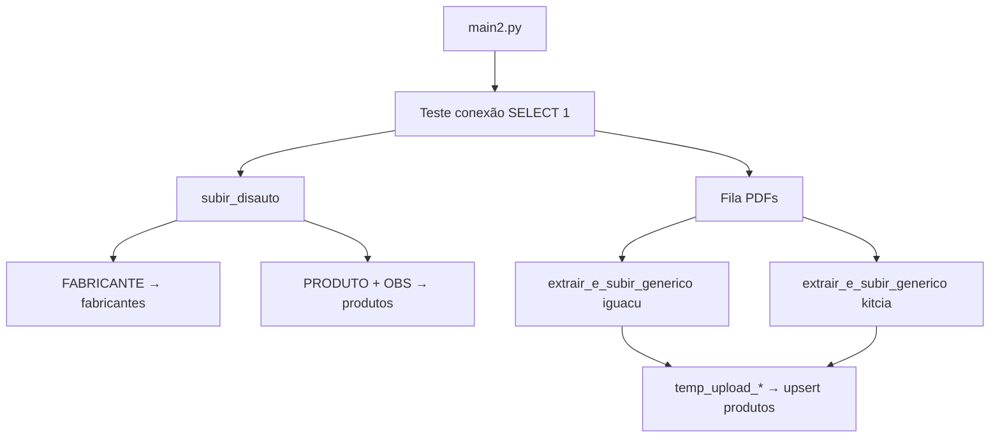

# Histórico do Projeto — Pipeline de Catálogos de Autopeças

Documento vivo de **controle do time**: o que foi feito, como executar e decisões técnicas.  
Fonte canônica da evolução do produto neste repositório (não depende de `/octo:history` nem de run stores externos).

**Projeto Supabase:** `oxqojsmlbptmofmhyfea` · URL: `https://oxqojsmlbptmofmhyfea.supabase.co`

**MVP 100 catálogos (WhatsApp HD):** `MVP_VALIDACAO.md` · **Roadmap:** `docs/ROADMAP_MVP.md` · **UX balcão:** `docs/UX_MELHORIAS_BALCAO.md` · Escala: `ARQUITETURA_ESCALA.md`  
**Agente n8n / GPASI:** `docs/API_GPASI_NO_N8N.md` · `docs/RELATORIO_TESTE_GPASI_AGENTE.md` · **Prompt Maria:** `Prompt.md` · **TecDoc VPS v2:** `docs/HANDOFF_BACKEND_TECDOC_API_V2.md`

**Status (set/2026):** app web Next.js **retomado** como **ERP 2.0** (Piroli Autopeças) — Pessoas, RH, entitlements SaaS, painel super admin. Agente WhatsApp (n8n/GPASI) segue como frente paralela — ver §17+ e §22.

---

## 1. Objetivo

Consolidar mais de 300 catálogos de autopeças (PDFs e planilhas) em um banco PostgreSQL no Supabase, com:

- Tabelas normalizadas: `fabricantes`, `produtos`, `referencias_cruzadas`
- Ingestão em lote via **staging tables** + `INSERT ... ON CONFLICT`
- Orquestração centralizada em **`main2.py`** (o `main.py` permanece intocado como fallback)

A partir de jul–ago/2026 o escopo operacional expandiu para o **atendimento WhatsApp** (agente “Maria” no n8n), consultando estoque/preço reais via **GPASI** e catálogo/TecDoc — enquanto o app de balcão ficou em pausa (§17). Em **set/2026** o app Next.js foi retomado como **ERP 2.0** (Pessoas + RH + painel SaaS) — ver §22.

---

## 2. Estrutura do repositório

```text
Projeto Leo/
├── src/                    # App web Next.js 15 (App Router) — ERP 2.0 ativo (§22)
│   ├── app/                # rotas (login + área autenticada + Pessoas/RH/admin)
│   ├── components/         # UI (shell, busca, orçamento, catálogos…)
│   ├── lib/                # Supabase, actions, crypto, RH, IA, loja, tecdoc
│   └── middleware.ts       # refresh de sessão Supabase SSR
├── catalogos/              # entrada (PDF/XLSX aguardando)
├── catalogos_extraidos/    # processados com sucesso
├── catalogos_erro/         # falhas (opcional)
├── scripts/                # Python: ingestão + GPASI/Redis/agente
│   ├── main2.py            # orquestrador MVP catálogos
│   ├── gpasi_*.py          # sync Redis, search API, smoke, enrich
│   ├── systemd/            # timers VPS (catalog / prices / enrich)
│   └── …                   # catalogo_utils, backfills TS, etc.
├── sql/
│   ├── migrations/         # schema app + ERP 2.0 (007–012) + RPCs agente 006
│   └── vps/                # TecDoc API v2 (indexes + views PostgREST)
├── docs/                   # roadmap, UX, GPASI/n8n, TecDoc, ERP 2.0 (`docs/erp-2.0/`)
├── Prompt.md               # system prompt do agente Maria (n8n)
├── .env.example            # placeholders (sem secrets reais)
└── README.md
```

| Script | Função |
|--------|--------|
| `scripts/main2.py` | Lê `catalogos/`, envia à nuvem, move para `catalogos_extraidos/` |
| `scripts/catalog_configs.py` | Regras de parsing por layout |
| `scripts/storage_uploader.py` | Imagens → Supabase Storage (quota 50 MB) |
| `scripts/main.py` | Pipeline legado (não alterar) |
| `scripts/gpasi_redis_sync.py` | Sync GPASI → Redis (`--catalog` / `--prices` / `--enrich`) |
| `scripts/gpasi_search_api.py` | Microserviço `/search` + `/peca/{codigo}` para o n8n |
| `scripts/gpasi_agent_smoke_test.py` | Smoke/recon da API GPASI (produção) |
| `scripts/gpasi_enrich_aplicacao.py` | Enrich de aplicação veicular |
| `scripts/systemd/gpasi-redis-*.{service,timer}` | Agendamento na VPS |

### Dados

Arquivos de catálogo ficam em **`catalogos/`** (não mais na raiz do projeto).

---

## 3. Schema do banco (aplicado em 20/05/2026)

Migration MCP: `create_catalog_tables`

### Tabelas

**`fabricantes`**

- `id`, `nome_fabricante`, `origem_catalogo`, `codigo_original_fornecedor`
- `UNIQUE (nome_fabricante, origem_catalogo)`

**`produtos`**

- `codigo_produto_interno`, `numero_produto`, `descricao`, `unidade`, `foto_url`, `observacoes`, `origem_catalogo`, `fabricante_id`
- `UNIQUE (codigo_produto_interno, origem_catalogo)`
- FK → `fabricantes(id)`

**`referencias_cruzadas`**

- `produto_id`, `numero_referencia`, `fabricante_referencia`
- FK → `produtos(id)` (ainda não populada pelos extratores atuais)

### Correção aplicada no DDL

No `schema.sql` original havia typo na constraint: `origin_catalogo` → corrigido para **`origem_catalogo`**.

### Segurança (RLS)

O advisor do Supabase reportou **RLS desabilitado** nas três tabelas. Para API pública com anon key, avalie políticas antes de habilitar:

```sql
ALTER TABLE public.fabricantes ENABLE ROW LEVEL SECURITY;
ALTER TABLE public.produtos ENABLE ROW LEVEL SECURITY;
ALTER TABLE public.referencias_cruzadas ENABLE ROW LEVEL SECURITY;
-- Em seguida, crie políticas adequadas ao seu caso de uso.
```

---

## 4. Sessão de trabalho — 20/05/2026

### Passo 1 — Schema no Supabase ✅

- Aplicado via MCP `apply_migration` (equivalente a rodar `schema.sql`)
- Verificado com `list_tables`: 3 tabelas criadas, 0 linhas

### Passo 2 — Revisão e ajustes de código ✅

| Mudança | Motivo |
|---------|--------|
| `db_connection.py` lê env vars | Remover senha/host hardcoded; suportar `DATABASE_URL` |
| `main2.py` orquestra Disauto + PDFs | Antes só rodava PDFs; faltava Disauto |
| `extractor_engine.py` aceita `engine` | Reutilizar uma conexão na esteira |
| `extract_disauto.py` lê `.xlsx` | CSVs não estavam na pasta; só o Excel |

### Passo 3 — Dependências ✅

Ambiente virtual local:

```bash
cd "/Users/vinicius/Documents/Projeto Leo"
python3 -m venv .venv
source .venv/bin/activate
pip install -r requirements.txt
```

Pacotes: `pandas`, `sqlalchemy`, `psycopg2-binary`, `pdfplumber`, `tqdm`, `openpyxl`.

### Passo 4 — Execução do `main2.py` ✅ (21/05/2026)

Primeiro teste completo (~98s). Correções aplicadas na sessão:

- `.env`: URI direta `db.*.supabase.co` não resolve em IPv4 nesta rede → migrado para **Session pooler** `aws-1-sa-east-1.pooler.supabase.com`
- `extract_disauto.py`: `.str.strip()` e coluna `fabricante_id` após merge

**Resultados no Supabase:**

| origem_catalogo | produtos |
|-----------------|----------|
| disauto | 48.555 |
| iguacu | 4 |
| kitcia | 1.178 |
| **fabricantes** | **1.626** |

**Atualização 21/05:** Iguaçu reprocessado com regex → **675** códigos únicos (~679 linhas no banco).

---

## 11. Imagens no Supabase Storage (quota 50 MB)

**Disauto/Excel:** fotos **ignoradas** (sem upload a partir do xlsx).

**PDFs:** extraídas, redimensionadas e enviadas ao bucket **`produtos-imagens`** (criado em 21/05/2026).

### Compressão (plano free)

| Variável `.env` | Padrão | Função |
|-----------------|--------|--------|
| `STORAGE_QUOTA_MB` | 50 | Para ao atingir o teto |
| `IMAGE_MAX_SIDE` | 320 | Maior lado (px) |
| `IMAGE_JPEG_QUALITY` | 58 | Qualidade JPEG |

### Primeiro upload (PDFs)

| Catálogo | Imagens | ~Tamanho |
|----------|---------|----------|
| Iguaçu | 688 | 1,5 MB |
| Kit&Cia | 2.701 | 3,4 MB |
| **Total** | **~3.389** | **~5 MB** (sobra na quota) |

URL: `https://oxqojsmlbptmofmhyfea.supabase.co/storage/v1/object/public/produtos-imagens/iguacu/pdf/p006_01.jpg`

Vínculo automático código ↔ foto na mesma página: passo futuro.

**Como rodar:**

```bash
cd "/Users/vinicius/Documents/Projeto Leo"
cp .env.example .env
# Edite .env com a senha do banco (Settings → Database no Supabase)

export $(grep -v '^#' .env | xargs)   # ou: source um script que exporte as vars
source .venv/bin/activate
python main2.py
```

Senha: Supabase Dashboard → **Project Settings → Database** → Database password (ou Connection string URI).

O `db_connection.py` carrega automaticamente um arquivo `.env` na raiz do projeto (se existir), sem precisar de `python-dotenv`.

---

## 5. Fluxo do `main2.py`



Ordem de execução:

1. **Disauto** — fabricantes e produtos completos (com `fabricante_id`)
2. **Iguaçu** — PDF, regras em `catalog_configs['iguacu']`
3. **Kit&Cia** — PDF, regras em `catalog_configs['kitcia']`

Erros em um catálogo **não interrompem** a fila (try/continue).

---

## 6. Configuração de catálogos PDF

Arquivo: `catalog_configs.py`

| Chave | Origem | Regra principal |
|-------|--------|-----------------|
| `iguacu` | `iguacu` | Regex de código `\d{3}\.\d{4}` (ex: `201.0813`) + seção do produto |
| `kitcia` | `kitcia` | Linhas que começam com número (`apenas_numeros_no_inicio`) |

Para novo catálogo: analisar amostra do PDF, adicionar entrada no dicionário e incluir `{"path": "...", "config": "..."}` na fila do `main2.py`.

---

## 7. Padrão de ingestão (staging)

1. Extrair dados → `pandas.DataFrame`
2. `df.to_sql('temp_upload_<origem>', engine, if_exists='replace')`
3. `INSERT INTO produtos ... ON CONFLICT DO UPDATE`
4. `DROP TABLE temp_upload_<origem>`

Disauto usa o mesmo padrão com `fab_temp_disauto` e `prod_temp_disauto`.

---

## 8. MCP Supabase (Cursor)

Configurado em `~/.cursor/mcp.json`:

```json
"url": "https://mcp.supabase.com/mcp?project_ref=oxqojsmlbptmofmhyfea"
```

Ferramentas usadas nesta sessão:

- `apply_migration` — DDL
- `list_tables` — validação do schema

O MCP **não substitui** a senha do Postgres para o Python: o `main2.py` conecta via SQLAlchemy/psycopg2 com credenciais locais.

---

## 9. Próximos passos sugeridos

- [ ] Configurar `.env` e rodar `main2.py` até o fim
- [ ] Conferir contagens: `SELECT origem_catalogo, COUNT(*) FROM produtos GROUP BY 1`
- [ ] Popular `referencias_cruzadas` (aba `REFERENCIACRUZADA` no xlsx Disauto)
- [ ] Habilitar RLS + políticas se houver exposição via API
- [ ] Adicionar novos catálogos em `catalog_configs.py` + fila do `main2.py`
- [ ] Considerar `python-dotenv` para carregar `.env` automaticamente

---

## 10. Changelog

| Data | Ação |
|------|------|
| 2026-05-20 | Migration `create_catalog_tables` no Supabase |
| 2026-05-20 | Fix typo `origin_catalogo` → `origem_catalogo` em `schema.sql` |
| 2026-05-20 | `main2.py` unificado (Disauto + PDFs) |
| 2026-05-20 | `db_connection.py` via variáveis de ambiente |
| 2026-05-20 | `extract_disauto.py` suporte a `catalogo_disauto.xlsx` |
| 2026-05-20 | `.venv` + `requirements.txt` + `.env.example` |
| 2026-05-20 | Criação deste `PROJETO_HISTORICO.md` |
| 2026-05-21 | Primeiro `main2.py` OK; pooler IPv4; fixes Disauto; 49.737 produtos |
| 2026-05-21 | Iguaçu: regex `201.xxxx` → 675 produtos; `storage_uploader.py` |
| 2026-05-21 | Bucket `produtos-imagens`; ~3,4k fotos PDF comprimidas (~5 MB) |
| 2026-05-21 | MVP: `catalogos`+`ingestao_jobs`, fila JSON, cap imagens/catálogo |
| 2026-05-21 | Pastas: `scripts/`, `catalogos/`, `catalogos_extraidos/`; main2 por pasta |
| 2026-07-02 | **App web:** code review, correções de bugs/segurança, middleware, testes — ver § 12 |
| 2026-07-03 | Redesign visual SaaS + UX P0 balcão — ver § 12 |
| 2026-07-03 | Backend: normalização, RPC `buscar_produtos` / `salvar_orcamento`, backfill (~86k) — ver § 13 (`a484091`) |
| 2026-07-05–06 | Agregados MVP + FE-09/16/17 + migration 005 + backfill referências — ver § 14 (`5cf38ac`, `fc71b50`) |
| 2026-07-16–18 | Busca federada TecDoc no app + API TecDoc v2 na VPS — ver §§ 15–16 (`a30eddf`) |
| 2026-07–ago | **Pivot:** app web pausado; foco no agente WhatsApp (n8n) — ver § 17 |
| 2026-08-04–05 | Recon GPASI produção + correções (`peca/dados` bloco≥1; similares só por código) — ver § 18 |
| 2026-08-05–12 | Docs n8n, Redis sync, `gpasi-search`, RPCs 006/007, Prompt Maria — ver §§ 18–21 |
| 2026-09-08–15 | **ERP 2.0:** Pessoas, entitlements, cripto, RH, painel super admin — ver § 22 |

---

## 12. App Web — sessão 02/07/2026

### Contexto

Revisão profunda do app Next.js (`src/`) após o MVP 1.0 de telas. Objetivo: corrigir bugs bloqueadores, endurecer segurança/sessão, alinhar documentação e registrar decisões de produto antes de implementar as melhorias de UX do balcão (`docs/UX_MELHORIAS_BALCAO.md` — **futuro**, não nesta sessão).

**Stack validada:** Next.js `15.5.19` + React 19 + Supabase SSR + Tailwind 4.

### Decisões de produto (alinhadas com o autor)

| Tópico | Decisão | Motivo |
|--------|---------|--------|
| `.env.example` | Chaves reais **não** foram commitadas; arquivo corrigido com placeholders | Evitar vazamento; pipeline e app usam vars diferentes |
| Multi-loja | **Modelo já é multi-tenant** (`lojas` + `membros_loja` + RLS); UX de **1 loja por usuário** no MVP 1.0 | Várias revendas podem usar o mesmo catálogo central; troca de loja fica para MVP 2.0+ |
| Carrinho de orçamento | Permanece em **`localStorage`** no MVP 1.0 | Menos complexidade; sync server-side documentada no `ROADMAP_MVP.md` § 3 |
| WhatsApp suporte | Fallback **`5561998117002`** quando loja sem telefone | Card "Suporte Técnico" no dashboard sempre funcional |
| Busca por relevância | Melhoria incremental: **normalização de código** (tolerância a `.`, `-`, espaço); FTS real fica no roadmap | Caso típico de balcão: `201.0813` vs `2010813` |
| UX balcão | Pesquisa em `docs/UX_MELHORIAS_BALCAO.md` — implementação **posterior** | Foco desta sessão: código estável, não redesign |

### Correções aplicadas

#### Segurança e sessão

| Mudança | Arquivo(s) | Motivo |
|---------|------------|--------|
| **`src/middleware.ts` criado (runtime Node.js)** | `middleware.ts` → `lib/supabase/proxy.ts`; `next.config.ts` | `updateSession` existia mas não estava ligado. **Atenção:** o middleware foi removido em commits anteriores porque o **edge runtime** falhava com o Supabase SSR na Vercel (`MIDDLEWARE_INVOCATION_FAILED`). Reintroduzido com `runtime: "nodejs"` + `experimental.nodeMiddleware: true`, que evita o edge. Confirmado no build: `middleware-manifest.json` vazio e artefato `.next/server/middleware.js` (Node) |
| **`.env.example` com placeholders** | `.env.example` | Separar vars públicas (`NEXT_PUBLIC_*`) das do pipeline (`SERVICE_ROLE_KEY`, `DATABASE_URL` comentadas) |
| **Guard de dono no upload** | `catalogos/upload/page.tsx` + `components/catalogos/upload-form.tsx` | Só `papel === "dono"` vê o formulário; RLS já bloqueava, mas UX evitava página inútil |
| **Validação de tamanho de arquivo** | `upload-form.tsx` | UI prometia 50 MB; código não validava |

**Impacto do middleware / decisão de runtime:** Next instalado é `15.5.19`. A primeira tentativa (edge, padrão) gerava `ƒ Middleware` no build — exatamente o caminho que quebrou antes na Vercel. Trocado para **runtime Node.js** via `runtime: "nodejs"` no middleware + `experimental.nodeMiddleware: true` no `next.config.ts`. O flag é aceito em runtime pelo Next 15.5.19 (aparece em "Experiments ✓ nodeMiddleware"), mas ainda não está tipado em `ExperimentalConfig` — daí o `@ts-expect-error` no `next.config.ts` e um warning benigno de schema no build. **Risco residual:** `nodeMiddleware` é experimental; validar no primeiro deploy da Vercel. Se falhar, alternativa é remover o middleware e manter proteção via `(app)/layout.tsx`.

#### Bugs

| Bug | Correção | Arquivo |
|-----|----------|---------|
| Query usava coluna `codigo` inexistente | Trocado para `codigo_produto_interno` | `clientes/[id]/page.tsx` |
| Orçamento órfão se insert de itens falha | Rollback manual: `delete` no cabeçalho | `lib/actions/orcamentos.ts` |
| `clienteId` sem checagem de tenant | Valida `clientes.id` + `loja_id` antes de vincular | `lib/actions/orcamentos.ts` |
| Quantidade/preço inválidos | Saneamento: qtd ≥ 1, preço ≥ 0 | `lib/actions/orcamentos.ts` |
| WhatsApp dashboard sem DDI `55` | Helpers centralizados + fallback padrão | `lib/whatsapp.ts`, `page.tsx` |
| Links `wa.me` duplicados no CRM | Uso de `buildContatoLojaUrl` | `clientes/page.tsx`, `clientes/[id]/page.tsx` |
| `eslint.config.mjs` quebrado | Reescrito com `FlatCompat` (ESLint 9) | `eslint.config.mjs` |
| `getContextoLoja` não determinístico | `.order("loja_id")` antes de `.limit(1)` | `lib/loja.ts` |

#### Busca

- Função `apenasCodigo()` remove separadores (`.`, `-`, espaço, `/`) para match adicional em `codigo_produto_interno`, `numero_produto` e `referencias_cruzadas`.
- Ranking por relevância textual (FTS) permanece no roadmap; esta melhoria cobre o caso de código digitado com formatação diferente.

#### Acessibilidade (quick wins)

| Mudança | Onde | Motivo |
|---------|------|--------|
| Removido `opacity-0 group-hover:opacity-100` | `busca`, `historico`, `clientes` | Ações invisíveis para teclado e leitores de tela |
| `aria-label` em botões só-ícone | `busca`, `clientes`, `whatsapp-row-button` | WCAG: ícone sem texto acessível |

**Pendente (UX doc):** layout mobile (sidebar fixa `w-64`), modais com focus trap, busca reestruturada — ver `docs/UX_MELHORIAS_BALCAO.md` Fases A–F.

#### Testes

- **Vitest** adicionado (`vitest.config.ts`, `npm test`).
- **`src/lib/whatsapp.test.ts`**: 13 testes cobrindo normalização de telefone, URLs, mensagens de produto/orçamento.
- Primeira suíte automatizada do app web.

#### Documentação

| Arquivo | O que mudou |
|---------|-------------|
| `README.md` | Reescrito para estrutura real na raiz (removido monorepo `app/` e `vercel.json`) |
| `docs/ROADMAP_MVP.md` | Nota explícita: carrinho em `localStorage` no 1.0; persistência server-side no 2.0 |
| `docs/UX_MELHORIAS_BALCAO.md` | Criado (pesquisa UX balcão — referência futura) |
| `PROJETO_HISTORICO.md` | Esta seção § 12 |

### Arquivos novos nesta sessão

```
src/middleware.ts
src/components/catalogos/upload-form.tsx
src/lib/whatsapp.test.ts
vitest.config.ts
docs/UX_MELHORIAS_BALCAO.md
```

### Como validar localmente

```bash
npm install
cp .env.example .env.local   # preencher NEXT_PUBLIC_SUPABASE_*
npm run lint                 # 0 erros (2 warnings de Google Fonts pré-existentes)
npm test                     # 13 testes whatsapp
npm run build                # inclui Middleware compilado
npm run dev
```

### Próximos passos sugeridos (app web)

- [ ] Implementar quick wins de UX (`docs/UX_MELHORIAS_BALCAO.md` § 5 — Fase A)
- [ ] Testes das server actions (`orcamentos`, `clientes`) com Supabase local ou mocks
- [ ] Layout responsivo (sidebar colapsável, barras fixas sem `left-64` em mobile)
- [ ] RPC Postgres transacional para `salvarOrcamento` (substituir rollback manual)
- [ ] Full-text search no Postgres ou Meilisearch (ranking real de relevância)
- [ ] UI de troca de loja (quando usuário pertencer a múltiplas revendas)

### Changelog app web (detalhe)

| Data | Arquivo / área | Ação |
|------|----------------|------|
| 2026-07-02 | `middleware.ts` | Sessão Supabase SSR + guards de rota |
| 2026-07-02 | `clientes/[id]/page.tsx` | Fix `codigo_produto_interno` |
| 2026-07-02 | `orcamentos.ts` | Validação cliente, saneamento itens, rollback |
| 2026-07-02 | `whatsapp.ts` | `WHATSAPP_PADRAO`, normalização, `buildContatoLojaUrl` |
| 2026-07-02 | `busca/page.tsx` | Normalização de código na busca |
| 2026-07-02 | `catalogos/upload` | Guard dono + componente client extraído |
| 2026-07-02 | `eslint.config.mjs` | FlatCompat ESLint 9 |
| 2026-07-02 | `whatsapp.test.ts` | 13 testes unitários |
| 2026-07-02 | `busca`, `historico`, `clientes` | Acessibilidade: ações sempre visíveis |

### UX balcão — quick wins P0 (02/07/2026)

Implementação das prioridades P0 de `docs/UX_MELHORIAS_BALCAO.md` para dar "cara de software de verdade", sem tocar em auth/middleware/server actions.

| Item (doc) | O que foi feito | Arquivos |
|------------|-----------------|----------|
| Shell responsivo | Sidebar vira **drawer** no mobile (hambúrguer no header, backdrop, fecha no Escape/rota); fixa em `lg+`. `ml-64`/`left-64` → `lg:`. Estado coordenado por client wrapper `NavShell` (layout segue server component) | `components/shell/nav-shell.tsx` (novo), `sidebar.tsx`, `header.tsx`, `footer.tsx`, `(app)/layout.tsx`, `produto/acoes.tsx`, `orcamento/barra-acoes.tsx` |
| Linha de busca (§4.1) | Título (descrição) + código destacado + chips de referências cruzadas; coluna `Fabricante` vazia → **Aplicação/Referências**; botão **+ Orçamento** na linha; selo "via referência"; placeholder de foto discreto; colunas secundárias colapsam no mobile | `busca/page.tsx`, `components/busca/adicionar-orcamento-button.tsx` (novo) |
| Detalhe do produto (§4.2) | Códigos em **chips copiáveis**; referências como chips; seção Aplicações com placeholder intencional | `produtos/[id]/page.tsx`, `components/produto/codigo-chip.tsx` (novo) |
| WhatsApp (§4.5) | **Prévia editável** (`<textarea>`) no modal de orçamento e de produto; envio usa o texto editado (`buildWhatsAppUrl`); "Enviar WhatsApp" como ação primária | `orcamento/barra-acoes.tsx`, `produto/acoes.tsx` |
| P1 | Estado vazio da busca com sugestões (remover hífens, só código, suporte); login/footer sem `href="#"` quebrado | `busca/page.tsx`, `login/page.tsx`, `footer.tsx` |

Validação: `npm run build` ✓, `npm test` ✓ 13/13, `npm run lint` ✓ 0 erros.

**Pendente (próximo incremento UX):** focus trap real nos modais e no drawer; match exato priorizado + autocomplete/atalhos de teclado (`/`, `A`, `W`) na busca; dados de aplicação por veículo e estoque/preço (MVP 2.0).

### Redesign visual "SaaS moderno" (03/07/2026)

Feedback do dono: a UI ainda tinha "cara de software datado" (navy chapado + cinzas), lembrando o ERP legado (SS Plus v12). Redesign para estética moderna (referências Linear/Vercel/Stripe), mantendo densidade operacional e toda a funcionalidade.

| Área | Mudança |
|------|---------|
| Paleta (`globals.css` `@theme`) | Neutros **slate**; primária **azul `#2563eb`** (era navy `#002046`); acento **esmeralda `#059669`** (CTA/WhatsApp — aceno sutil ao verde do SS Plus); tertiary slate; error moderno. Nomes dos tokens preservados → propaga por todo o app |
| Sidebar | **Slate escuro `#0f172a`** (não usa mais `bg-primary`), item ativo com realce esmeralda + `aria-current`, badge do carrinho esmeralda |
| Componentes/telas | `rounded-xl` em containers, sombras suaves, hover elevando, `focus-visible:ring` consistente; header com `backdrop-blur`; **paginação da busca em pílula** (Anterior/Próxima + "Página X de Y"); login repaginado; modais com `role="dialog"` |
| Acessibilidade | Contrastes AA/AAA verificados (branco/slate-900 ~15:1; azul/branco ~4.6:1; esmeralda/branco ~4.5:1); foco de teclado visível |

Validação: `npm run build` ✓, `npm test` ✓ 13/13, `npm run lint` ✓ 0 erros.

**Pendente:** polish de `veiculo`, `configuracoes`, `catalogos/upload`, `clientes/[id]`, `clientes/novo` (herdam a paleta via tokens, mas sem `rounded-xl`/sombras ainda); dark mode completo (só a sidebar é dark).

---

## 13. Backend — normalização, busca com ranking e orçamento transacional (03/07/2026)

Sessão de implementação do handoff `docs/HANDOFF_BACKEND_MELHORIAS.md` (P0 + P1 + BE-09). Migrations aplicadas no Supabase `oxqojsmlbptmofmhyfea`.

### Migrations aplicadas

| Arquivo | Entrega |
|---------|---------|
| `sql/migrations/001_produto_normalizacao.sql` | Colunas estruturadas em `produtos` + índices `pg_trgm` |
| `sql/migrations/002_buscar_produtos.sql` | RPC `buscar_produtos` com ranking por `match_tipo` / `score` |
| `sql/migrations/003_salvar_orcamento.sql` | RPC `salvar_orcamento` transacional |

### Pipeline de normalização (BE-01 / BE-02)

| Componente | Arquivo |
|------------|---------|
| Normalizador | `src/lib/produto-normalizador.ts` (+ 6 testes Vitest) |
| Helpers UI | `src/lib/produto-campos.ts` (`tituloExibicao`, `codigoExibicao`, `labelMatchTipo`) |
| Backfill | `scripts/backfill-normalizacao.ts` — `npm run backfill:normalizacao` |
| Parser display (fallback) | `src/lib/descricao-parser.ts` (mantido) |

**Regras principais:**
- `descricao_original` preserva texto bruto; `titulo_normalizado` limpa ruído de PDF
- `codigo_principal` escolhido com regras de confiança; corrige `codigo_produto_interno` só com confiança alta
- Se correção viola `UNIQUE (codigo_produto_interno, origem_catalogo)`, grava só `codigo_principal`
- `normalizacao_status`: `ok` \| `parcial` \| `revisar`

### Busca e orçamento integrados no app

| Área | Mudança | Arquivo |
|------|---------|---------|
| Busca | RPC `buscar_produtos` + badges `match_tipo`; fallback legado | `lib/busca-produtos.ts`, `busca/page.tsx` |
| Detalhe | `codigo_principal`, `aplicacao_resumo`, `descricao_original` | `produtos/[id]/page.tsx` |
| Orçamento | RPC `salvar_orcamento` atômica; fallback manual | `lib/actions/orcamentos.ts` |
| Types | Colunas novas + assinaturas RPC | `lib/supabase/types.ts` |

### Backfill em produção

Execução iniciada em 03/07/2026 (~86.442 produtos). Piloto 500: `ok=500`, `codigos_corrigidos=1`, `erros=1` (conflito unique — corrigido no script).

Consultar progresso:

```sql
SELECT count(*) FILTER (WHERE normalizado_em IS NOT NULL) AS normalizados,
       count(*) FILTER (WHERE normalizado_em IS NULL) AS pendentes,
       count(*) FROM produtos;
SELECT normalizacao_status, count(*) FROM produtos WHERE normalizado_em IS NOT NULL GROUP BY 1;
```

### Validação

- `npm test` ✓ 35/35
- `npm run build` ✓
- RPCs verificadas: `buscar_produtos`, `salvar_orcamento`

### Handoff frontend

Documento de retorno: `docs/HANDOFF_BACKEND_MELHORIAS.md`  
Tarefas frontend prioritárias: **FE-09** (highlight match), **FE-16** (dashboard/histórico), **FE-17** (medidas no detalhe).

**Pendente backend (P2/P3):** BE-06 aplicações estruturadas, BE-07 equivalências tipadas, BE-08 estoque/preço, hook na ingestão Python.

---

## 14. Agregados MVP + quick wins de busca FE-09/16/17 + migration 005 (05–06/07/2026)

### Agregados de montagem (MVP demo)

Cadastro de peças complementares (batente, coifa, rolamento…) com regras **globais** — PRD em `docs/PRD_AGREGADOS.md`. Commit `5cf38ac`.

| Entrega | Arquivo |
|---------|---------|
| Migration `produto_relacoes` + RLS (authenticated CRUD para demo) | `sql/migrations/004_produto_relacoes.sql` — **aplicada no Supabase** |
| Queries de agregados | `src/lib/agregados.ts` |
| Server actions (criar/remover/buscar) | `src/lib/actions/agregados.ts` |
| Tela de cadastro | `src/app/(app)/agregados/page.tsx` + `components/agregados/form-cadastro.tsx` |
| Chips “Montagem:” + botão “+ Agregados” na busca | `components/agregados/agregados-busca-row.tsx`, `adicionar-agregados-button.tsx` |
| Seção “Itens da montagem” no detalhe | `produtos/[id]/page.tsx` |

**Pendente:** seed de demonstração; restringir cadastro ao papel `dono` (P1 do PRD).

### Quick wins de busca (FE-09 / FE-16 / FE-17 / E4)

Executados via agente frontend (06/07/2026), alinhados à reunião de produto do mesmo dia (código original como métrica principal; ver `docs/ROADMAP_MVP.md` § 2.1).

| ID | Entrega | Arquivos |
|----|---------|----------|
| FE-09 | Destaque do `match_valor`: código com `bg-primary-container` quando match por código; chip de referência destacado e reordenado quando match por referência; helper `normalizarCodigo()` replica `normalizar_codigo_busca` do banco | `busca/page.tsx`, `produto-campos.ts` |
| FE-16 | Dashboard e histórico com `tituloExibicao`/`codigoExibicao` (selects ganharam `titulo_normalizado`, `codigo_principal`) | `page.tsx`, `historico/page.tsx` |
| FE-17 | Chips de `medidas_extraidas` no detalhe (ícone `straighten`, visual neutro) | `produtos/[id]/page.tsx` |
| E4 | `aplicacao_resumo` na linha da busca (`line-clamp-1`) | `busca/page.tsx`, `busca-produtos.ts` |

### Migration 005 — RPC `buscar_produtos` retorna `aplicacao_resumo`

`sql/migrations/005_buscar_produtos_aplicacao.sql` — **aplicada no Supabase** (06/07/2026).

- `DROP FUNCTION` + `CREATE` (mudança de `RETURNS TABLE` não permite `CREATE OR REPLACE`).
- Correções de defeitos latentes da 002: ambiguidade `cand.score` no CTE e casts `::TEXT` para colunas `varchar(100)` (erro “structure of query does not match function result type”).
- Types (`supabase/types.ts`) e mapeamento (`busca-produtos.ts`) atualizados.

### Validação

- `npm test` ✓ 35/35 · `npm run build` ✓
- RPC validada no banco: busca com `aplicacao_resumo = "Randon"` retornando pelo caminho principal; listagem com `total_count = 86442`.
- Smoke E2E Playwright (build de produção local): login renderiza, erro amigável em credenciais inválidas, rotas protegidas (`/`, `/busca`, `/agregados`, `/produtos/[id]`, `/historico`) redirecionam para `/login`, console sem erros.
- E2E autenticado (usuário piloto, 15/15 ✓): FE-09 (badge "Código exato" + código destacado na busca por `1386677`), FE-16 (dashboard com 12 itens de histórico normalizados), FE-17 (2 chips de medidas no detalhe `/produtos/7792`), E4 (`aplicacao_resumo` em 24/25 linhas na busca "randon"), tela `/agregados` operacional.

### Backfill de referências cruzadas (06/07/2026)

A tabela `referencias_cruzadas` estava **vazia** (a busca por referência da RPC nunca casava). Novo script `scripts/backfill-referencias.ts` (`npm run backfill:referencias`) popula a tabela a partir de `produtos.codigos_extraidos` (extraídos na normalização BE-01).

| Métrica | Valor |
|---------|-------|
| Produtos com `codigos_extraidos` | 13.904 |
| Candidatos avaliados | 19.811 |
| Filtrados como ruído (`codigoConfiavel` + comprimento ≥ 3 + ≥ 2 chars distintos) | 10.053 |
| **Referências inseridas** | **9.758** |
| Erros | 0 |

- Idempotente (re-execução: `inseridos = 0`); leitura de existentes paginada (PostgREST trunca em 1000 linhas).
- `fabricante_referencia` fica `NULL` (fonte: extração de texto) — instrução de rollback no cabeçalho do script.
- Validado na RPC: busca `478` retorna produtos `1478` e `5995` com `match_tipo = referencia_exata` e chips de referência preenchidos.
- Limitação conhecida: são referências extraídas de texto de PDF, não amarrações OEM verificadas — a curadoria OEM real depende dos docs Partes Link/Gustavo (roadmap A8).

### Roadmap

`docs/ROADMAP_MVP.md` revisado com o alinhamento de produto de 06/07/2026 (§ 2.1): código OEM como métrica principal, desempate por aplicação/ano, épico busca por veículo (Fase F), dores de dados (slug/amarrações) e ações por responsável.

---

## 15. Busca federada TecDoc — PostgREST VPS (16/07/2026)

Integração **on-demand** (sem ETL dos 60M+ registros) da API PostgREST hospedada na VPS (`http://31.97.93.135:3005/view_busca_catalogo`).

### Entregas

| Componente | Arquivo |
|------------|---------|
| Cliente PostgREST + detalhe | `src/lib/tecdoc-catalog.ts` |
| Glossário PT→EN + heurísticas | `src/lib/tecdoc-termos.ts` (+ testes Vitest) |
| Merge na busca | `src/lib/busca-produtos.ts` (`fonte`, `totalLocal`, `totalTecdoc`) |
| UI mesma tabela + badge | `src/app/(app)/busca/page.tsx` |
| Detalhe read-only | `src/app/(app)/produtos/tecdoc/[articleId]/page.tsx` |
| Carrinho dedup por código | `src/lib/cart.ts` |
| Env | `TECDOC_API_URL` em `.env.example` / `.env.local` |

### Regras de segurança/performance

- Sempre `limit` (máx. 15 resultados, fetch bruto até 80 para compensar dedup)
- Timeout 5s; falha silenciosa → só catálogo local
- Só consulta TecDoc com termo ≥ 2 chars e **sem** filtro de catálogo local
- App **não** usa senha do Postgres TecDoc — só URL PostgREST server-side

### Validação

- `npm test` ✓ 45/45 · `npm run build` ✓ (rota `/produtos/tecdoc/[articleId]`)
- Integração ao vivo: `Gol` → Brake Fluid / GOLF; `filtro` → Oil Filter; detalhe article 30 com 27 aplicações
- E2E Playwright autenticado: login piloto retornou credenciais inválidas nesta sessão (senha pode ter sido rotacionada); cobrir UI após atualizar senha do usuário de teste

### Pendências (Fase 3)

- Estender VIEW TecDoc com código OEM/fabricante
- HTTPS + API key no Traefik
- Cache por termo

---

## 16. TecDoc API v2 na VPS (18/07/2026)

Evolução da API PostgREST na VPS para expor artigos, aplicações, referências e imagens **sem** cartesian product na view legada. Handoff: `docs/HANDOFF_BACKEND_TECDOC_API_V2.md`. SQL auditável: `sql/vps/tecdoc_api_v2_indexes.sql`, `sql/vps/tecdoc_api_v2_views.sql`.

### Implantado e validado

| Item | Estado |
|------|--------|
| Backup pré-deploy | `/root/tecdoc-backup-20260718-124027` |
| API legada `view_busca_catalogo` | Preservada (HTTP 200) |
| Views v2 (`artigos`, `aplicacoes`, `referencias`, `imagens`, `especificacoes`) | Implantadas |
| Índices código/OEM normalizados + 1ª JPEG | Válidos |
| PostgREST | Role limitada (`postgrest_authenticator`); `PGRST_DB_MAX_ROWS=100`; timeout 5s |
| Container rollback | `postgrest-legacy-20260718-125920` |

### Validação

- Legado e v2 retornam HTTP 200; tabelas-base anônimas → 401
- Busca por `article_number_normalized` / `oem_number_normalized` usa índice
- Consultas externas < 100 ms nos testes; sem `limit` → máx. 100 linhas

### Pendências operacionais (não bloqueiam v2)

1. HTTPS + autenticação + rate limit (Traefik)
2. Bloquear exposição pública direta da porta 3005 após validar o proxy
3. Rotacionar senha da role `postgres` após mapear PgBouncer
4. Integrar endpoints v2 no Catálogo Industrial / app (adiado com a pausa do app — §17)

---

## 17. Pivot de produto — app pausado, foco no agente n8n (jul–ago/2026)

### Decisão

Após a entrega da busca federada TecDoc no app (§15) e da API v2 na VPS (§16), a evolução do **app Next.js de balcão foi pausada**. A prioridade passou para o **agente de atendimento WhatsApp** orquestrado no **n8n** (“Maria”), consultando:

- **GPASI** (ERP Gestão Parts) — preço e estoque reais da rede Piroli
- **Catálogo sincronizado** (Redis + fallback Supabase) — busca por descrição / viscosidade / veículo
- **TecDoc / placa** — tools complementares de aplicação e identificação do veículo

### Por quê

Valor operacional imediato no atendimento ao cliente (WhatsApp), com estoque e preço de produção — em vez de continuar polish de UI do balcão interno sem dado de ERP ao vivo.

### O que ficou congelado no app

- Último commit relevante de produto no app: `a30eddf` (TecDoc federado, 18/07/2026)
- Pendências de UX/backend do balcão (estoque/preço no app, focus trap, dark mode, FE restantes) **não** avançaram nesta fase
- O código do app permanece no repositório e em produção; só a **fila de evolução** mudou

### O que passou a ser o “trabalho principal”

Documentado nas §§18–21: recon GPASI → guia n8n → Redis/`gpasi-search` na VPS → RPCs agente → prompt Maria.

---

## 18. Recon GPASI + integração n8n (04–12/08/2026)

**API:** Gestão Parts API Suite Integration (GPASI) **4.0.29** · Produção · Base `http://181.191.194.31:54123`

### Artefatos

| Artefato | Função |
|----------|--------|
| `docs/RELATORIO_TESTE_GPASI_AGENTE.md` | Relatório de smoke (04/08) + correções (05/08) |
| `docs/API_GPASI_NO_N8N.md` | Guia completo para montar workflows n8n |
| `scripts/gpasi_agent_smoke_test.py` | Script de teste automatizado |
| `docs/gpasi_smoke_results.json` / `gpasi_desc_search_probe.json` | Saídas de probe |

### Veredito (produção)

| Critério | Status |
|----------|--------|
| Auth OAuth2 `/token` (24h, sem `expires_in`) | OK — cache no n8n com margem 23h |
| Preço por código | OK (~180–230 ms); **preço único na rede** |
| Estoque v2 com `empresa` explícita | OK; **estoque por loja** |
| Busca nativa por descrição na GPASI | **Não existe** — sync + índice local |
| `GET /peca/dados` | OK com `bloco >= 1` (lento: 29–57 s/bloco) |
| `similarmestre` | Só aceita **código** de produto, não texto |

### Decisões de negócio (fase atual)

- Agente consulta estoque na **matriz `0001`** (e, no prompt, lojas físicas nomeadas Eldorado / Mundo Novo / Itaquiraí via tools dedicadas)
- Códigos empresa **espelho/AUX** não entram em soma de estoque (duplicam quantidade)
- Ambiente é **produção real** — agente só leitura (peça/preço/estoque); sem pedidos/WMS/financeiro

### Arquitetura n8n (resumo)

1. Sub-workflow de token com cache (`getWorkflowStaticData`)
2. Sync agendado do catálogo (não como tool por mensagem)
3. Tools por mensagem: busca local → preço → estoque (e similares sob demanda)

Detalhes e cURLs: `docs/API_GPASI_NO_N8N.md`.

---

## 19. Produção — Redis + `gpasi-search` (ago/2026)

Montar ~110k `HSET` nó a nó no n8n é inviável. Produção usa **Redis na VPS** + microserviço interno.

### Componentes

| Componente | Arquivo / recurso |
|------------|-------------------|
| Sync GPASI → Redis | `scripts/gpasi_redis_sync.py` (`--catalog`, `--prices`, `--enrich`, `--full`) |
| Search API (FastAPI) | `scripts/gpasi_search_api.py` — `GET /health`, `/search`, `/peca/{codigo}` |
| Docker | `scripts/gpasi_sync.Dockerfile`, `scripts/gpasi_search.Dockerfile` |
| systemd | `scripts/systemd/gpasi-redis-{catalog,prices,enrich}.{service,timer}` |
| Redis | container `tecdoc_redis` (rede `easypanel`), prefixo `gpasi:` |
| Search | container `gpasi-search:8080` |

### Fluxo

```text
systemd timers (VPS)
  → gpasi_redis_sync (--catalog / --prices / --enrich)
  → Redis gpasi:peca:* + gpasi:tok:* + gpasi:visc:* + gpasi:aplic:*
  → gpasi-search /search
       com modelo → interseção tok ∩ aplic (STRICT; miss limpo)
       sem modelo e ERP vazio → RPC buscar_produtos_agente (Supabase)
  → n8n tools do agente
Estoque continua live na GPASI (não espelhado no Redis).
```

### Regras da API de busca

- **STRICT:** com `modelo` preenchido, só Redis (sem Supabase); miss → `retry=false` (agente esclarece e rebusca no máx. 1×)
- Fallback Supabase: só sem `modelo` (ou `fonte=fornecedor`); service role **somente** no `gpasi-search`
- Catálogos de fornecedor no Supabase **não** são espelhados no Redis

Documentação operacional: `docs/API_GPASI_NO_N8N.md` §10.0.

---

## 20. RPCs `buscar_produtos_agente` (migrations 006 / 007)

Busca enxuta para o fallback do agente (não substitui a RPC `buscar_produtos` do app de balcão).

| Migration | Entrega |
|-----------|---------|
| `sql/migrations/006_buscar_produtos_agente.sql` | RPC `buscar_produtos_agente`: sem `total_count`, `LIMIT` cedo, `SECURITY DEFINER`, grant `service_role`, `statement_timeout` 2500ms |
| `sql/migrations/007_buscar_produtos_agente_sem_seqscan.sql` | Evita `57014` (timeout): remove padrões que forçam seq scan (`LIKE` sem `text_pattern_ops`, `ILIKE ALL` ignorando gin_trgm, fallback sem índice) |

**Colisão de número (set/2026):** a 007 efetiva no repositório do ERP 2.0 é `007_erp_pessoas.sql` (§22). A 007 do agente (`…sem_seqscan.sql`) não chegou a existir neste working tree; a RPC 006 do agente permanece untracked. Não misturar as duas frentes no mesmo commit.

Retorno tipado para o agente: `codigo`, `descricao`, `marca`, `aplicacao`, `catalogo`, `foto_url`, `referencias`, `match_tipo`.

---

## 21. Prompt do agente Maria (`Prompt.md`)

System prompt do atendimento WhatsApp (n8n). Identidade: balconista da Auto Peças Piroli (Eldorado-MS / fronteira PY).

### Capacidades documentadas no prompt

| Área | Conteúdo |
|------|----------|
| Estilo | Mensagens curtas estilo celular; sem travessão; emoji raro |
| Idiomas | PT / ES / guarani-jopara; busca interna sempre em PT; TecDoc em EN |
| Foto de peça | Identifica nome popular + pede placa/modelo; não repassa laudo técnico |
| Mapa de tools | `ConsultaPlaca`, `buscar_peca_catalogo`, `buscar_por_viscosidade`, Consulta TecDoc, `consultar_preco_peca`, estoque por loja (`…01` / `…04` / `…05`) |
| Sigilo | Nunca citar sistema, catálogo ou nome de ferramenta ao cliente |
| Preço | Informa via tool; fechamento/negociação com vendedor (handoff) quando aplicável |

Arquivo: `Prompt.md` (raiz). Trechos espelhados/ajustados também em `docs/API_GPASI_NO_N8N.md` §10.5.

---

## Status do time (15/09/2026)

| Frente | Estado | Notas |
|--------|--------|-------|
| Pipeline PDF/XLSX → Supabase | Entregue (mai/2026) | §§1–11 |
| App web Next.js | **Ativo — ERP 2.0** | Pessoas + RH + painel SaaS no piloto (`oxqojsmlbptmofmhyfea`). Branch `feat/erp-2.0` (§22). Balcão (busca/orçamento) permanece |
| TecDoc PostgREST VPS | **Operacional** | Legado + v2 (§§15–16); HTTPS/auth ainda pendente |
| Agente WhatsApp n8n + GPASI | **Ativo / WIP** | Docs e scripts locais; **não** entram no commit do ERP 2.0 |
| Infra self-host (Coolify + 4ª VPS PITR) | **Depois** | Schema já no Supabase gerenciado; cutover VPS não bloqueia o piloto |

### Artefatos do agente ainda untracked (git)

- `Prompt.md`
- `docs/API_GPASI_NO_N8N.md`, `docs/RELATORIO_TESTE_GPASI_AGENTE.md`, `docs/HANDOFF_BACKEND_TECDOC_API_V2.md`
- `docs/gpasi_smoke_results.json`, `docs/gpasi_desc_search_probe.json`
- `scripts/gpasi_*.py`, `scripts/gpasi_*.Dockerfile`, `scripts/systemd/gpasi-redis-*`
- `sql/migrations/006_buscar_produtos_agente.sql` (a 007 do agente não existe neste tree; 007 = ERP Pessoas)
- `sql/vps/tecdoc_api_v2_indexes.sql`, `sql/vps/tecdoc_api_v2_views.sql`
- `espelho-redis/`, `Reunião /` (prints + transcrição)

Quando forem commitados, atualizar esta tabela. **Não** misturar com `feat/erp-2.0`.

---

## 22. ERP 2.0 — Pessoas, RH e SaaS (08–15/09/2026)

Retomada do app Next.js como **produto multi-loja**, não clone do SS Plus. Piroli é o piloto; a arquitetura é de SaaS (módulos por loja, cripto em camadas, self-host depois).

`/octo:history` nesta sessão: **sem run store** em `~/.claude-octopus/runs/run-log.jsonl`. Esta seção é a fonte canônica do que foi feito.

### Origem

Reunião 08/09/2026 (Leandro, Gustavo, Léo). Transcrição e prints em `Reunião /` (não versionados nesta branch). Spec: `docs/erp-2.0/` (`INTENT.md`, `PRD.md`, `MODELO_PESSOAS.md`, `INFRA.md`, `SEGURANCA.md`, `FONTES_REUNIAO.md`).

### Decisões (não reabrir sem motivo)

| Tema | Decisão |
|------|---------|
| Produto | ERP revendável; Piroli = piloto. Não é clone do SS Plus |
| Cadastro | Uma pessoa, vários papéis. RH **não** vive dentro de Pessoas |
| Segurança | Cripto em camadas (TLS + disco + coluna AES-256-GCM + HMAC blind index). **Não** E2EE zero-knowledge |
| Entitlements | Super admin libera módulos por loja (`modulos` / `loja_modulos` / `super_admins`) |
| IA | Ollama no DGX via Tailscale; ledger append-only de tokens (009). Gateway de cobrança = P2 |
| Banco | Migrations 007–012 **aplicadas** no Supabase gerenciado `oxqojsmlbptmofmhyfea`. Self-host (Coolify + PITR na 4ª VPS) **depois** |
| Fora deste ciclo | NF-e, boleto Sicredi, WhatsApp oficial, Rede Âncora, eSocial, portal do funcionário |

### Schema (aplicado no piloto)

| Migration | Entrega |
|-----------|---------|
| `007_erp_pessoas.sql` | `pessoas`, papéis, endereços, contatos, documentos fiscais, `clientes.pessoa_id` |
| `008_erp_entitlements.sql` | Catálogo de módulos + liberação por loja + `super_admins` |
| `009_erp_tokens_ia.sql` | Ledger de tokens (append-only) |
| `010_erp_pessoas_storage.sql` | Bucket privado `pessoas` + policies |
| `011_erp_super_admin_visao.sql` | Visão agregada para o painel SaaS |
| `012_erp_rh.sql` | Contratos, dependentes, férias, afastamentos, advertências, folha, rescisões, documentos, `rh_tabelas_legais` + bucket `rh` |

RLS por `organizacao_id` em toda tabela nova. Colunas sensíveis (documento, salário, bancário, CID) cifradas no app (`src/lib/crypto/`); busca por HMAC.

### App (Next.js)

| Superfície | Caminho |
|------------|---------|
| Pessoas CRUD + webcam | `src/app/(app)/pessoas/*`, `src/components/pessoas/*`, `src/lib/actions/pessoas.ts` |
| Painel super admin | `src/app/admin/*` — super admin **sem loja** cai em `/admin` (não fica preso no layout da loja) |
| Guard de módulo | `src/lib/modulos.ts` + `requireModulo` |
| RH | `src/app/(app)/rh/*` — dashboard, funcionários, férias, folha, rescisão |
| Cálculos RH | `src/lib/rh/` — INSS/IRRF/FGTS/férias+1/3/13º/rescisão; faixas 2026 em `rh_tabelas_legais` (configuráveis; **sem eSocial**) |
| Upload RH | `src/lib/actions/rh-storage.ts` — upload/assinatura via `service_role` (upload client+RLS não persistia em `storage.objects`) |
| Backfill clientes | `scripts/backfill-clientes-pessoas.ts` (`npm run backfill:clientes-pessoas`) |
| Backup PITR (depois) | `scripts/backup/` (pgBackRest; ainda não no piloto) |
| CI | `.github/workflows/security.yml` — audit + tsc + lint + test |

`next.config.ts`: `experimental.serverActions.bodySizeLimit` 12mb (PDF de contrato).

### Bugs corrigidos nesta frente

| Sintoma | Causa | Correção |
|---------|-------|----------|
| Webcam sem imagem | `videoRef` nulo até `camAtiva` | `useEffect` anexa o stream depois do mount |
| Super admin sem loja preso | Layout `(app)` exige loja | Logout + redirect `/admin` |
| RH “Ativos” vazio (dashboard = 1) | PostgREST devolve embed 1:1 como **objeto**, não array; join interno no papel | Lista a partir de `rh_contratos` |
| Documento RH 400 Object not found | Path no banco, 0 rows em `storage.objects` (upload client) | Upload/sign server-side com admin client. **Validado 16/09/2026** (upload + abertura ok) |

### Verificação

- `npx tsc --noEmit` ok; Vitest **85** passando (crypto + libs RH).
- `npm run lint` ainda tem dívida antiga em `types.ts` (não introduzida pelo ERP).
- Módulo `rh` semeado e liberado para a loja piloto no painel super admin.
- Documentos RH: upload e abertura com URL assinada **ok** no piloto (16/09/2026).

### Pendências (próxima sessão)

- Self-host / VPS / pgBackRest.
- GPASI/n8n e pasta `Reunião /` continuam **fora** de `feat/erp-2.0` (PR [#1](https://github.com/ViniciusAutomotikLabs/catalogos-piroli/pull/1)).

---

*Atualize este arquivo a cada sessão relevante (migrations, novos catálogos, mudanças de regra de parsing, correções do app web, avanços do agente n8n/GPASI, ERP 2.0).*
