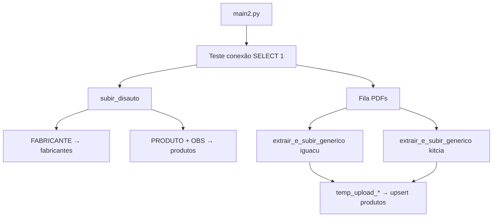

# Histórico do Projeto — Pipeline de Catálogos de Autopeças

Documento vivo com o que foi feito, como executar e decisões técnicas.  
**Projeto Supabase:** `oxqojsmlbptmofmhyfea` · URL: `https://oxqojsmlbptmofmhyfea.supabase.co`

**MVP 100 catálogos (WhatsApp HD):** ver `MVP_VALIDACAO.md` · **Roadmap produto:** `docs/ROADMAP_MVP.md` · Escala: `ARQUITETURA_ESCALA.md`

---

## 1. Objetivo

Consolidar mais de 300 catálogos de autopeças (PDFs e planilhas) em um banco PostgreSQL no Supabase, com:

- Tabelas normalizadas: `fabricantes`, `produtos`, `referencias_cruzadas`
- Ingestão em lote via **staging tables** + `INSERT ... ON CONFLICT`
- Orquestração centralizada em **`main2.py`** (o `main.py` permanece intocado como fallback)

---

## 2. Estrutura do repositório

```text
Projeto Leo/
├── catalogos/              # entrada (PDF/XLSX aguardando)
├── catalogos_extraidos/    # processados com sucesso
├── catalogos_erro/         # falhas (opcional)
├── scripts/                # todo o código Python
│   ├── main2.py            # orquestrador MVP
│   ├── catalogo_utils.py   # fila por pasta + inferência de layout
│   └── project_paths.py    # caminhos da raiz do projeto
├── sql/                    # schema.sql, schema_mvp.sql
├── .env
└── README.md
```

| Script | Função |
|--------|--------|
| `scripts/main2.py` | Lê `catalogos/`, envia à nuvem, move para `catalogos_extraidos/` |
| `scripts/catalog_configs.py` | Regras de parsing por layout |
| `scripts/storage_uploader.py` | Imagens → Supabase Storage (quota 50 MB) |
| `scripts/main.py` | Pipeline legado (não alterar) |

### Dados

Arquivos de catálogo ficam em **`catalogos/`** (não mais na raiz do projeto).

---

## 3. Schema do banco (aplicado em 20/05/2026)

Migration MCP: `create_catalog_tables`

### Tabelas

**`fabricantes`**

- `id`, `nome_fabricante`, `origem_catalogo`, `codigo_original_fornecedor`
- `UNIQUE (nome_fabricante, origem_catalogo)`

**`produtos`**

- `codigo_produto_interno`, `numero_produto`, `descricao`, `unidade`, `foto_url`, `observacoes`, `origem_catalogo`, `fabricante_id`
- `UNIQUE (codigo_produto_interno, origem_catalogo)`
- FK → `fabricantes(id)`

**`referencias_cruzadas`**

- `produto_id`, `numero_referencia`, `fabricante_referencia`
- FK → `produtos(id)` (ainda não populada pelos extratores atuais)

### Correção aplicada no DDL

No `schema.sql` original havia typo na constraint: `origin_catalogo` → corrigido para **`origem_catalogo`**.

### Segurança (RLS)

O advisor do Supabase reportou **RLS desabilitado** nas três tabelas. Para API pública com anon key, avalie políticas antes de habilitar:

```sql
ALTER TABLE public.fabricantes ENABLE ROW LEVEL SECURITY;
ALTER TABLE public.produtos ENABLE ROW LEVEL SECURITY;
ALTER TABLE public.referencias_cruzadas ENABLE ROW LEVEL SECURITY;
-- Em seguida, crie políticas adequadas ao seu caso de uso.
```

---

## 4. Sessão de trabalho — 20/05/2026

### Passo 1 — Schema no Supabase ✅

- Aplicado via MCP `apply_migration` (equivalente a rodar `schema.sql`)
- Verificado com `list_tables`: 3 tabelas criadas, 0 linhas

### Passo 2 — Revisão e ajustes de código ✅

| Mudança | Motivo |
|---------|--------|
| `db_connection.py` lê env vars | Remover senha/host hardcoded; suportar `DATABASE_URL` |
| `main2.py` orquestra Disauto + PDFs | Antes só rodava PDFs; faltava Disauto |
| `extractor_engine.py` aceita `engine` | Reutilizar uma conexão na esteira |
| `extract_disauto.py` lê `.xlsx` | CSVs não estavam na pasta; só o Excel |

### Passo 3 — Dependências ✅

Ambiente virtual local:

```bash
cd "/Users/vinicius/Documents/Projeto Leo"
python3 -m venv .venv
source .venv/bin/activate
pip install -r requirements.txt
```

Pacotes: `pandas`, `sqlalchemy`, `psycopg2-binary`, `pdfplumber`, `tqdm`, `openpyxl`.

### Passo 4 — Execução do `main2.py` ✅ (21/05/2026)

Primeiro teste completo (~98s). Correções aplicadas na sessão:

- `.env`: URI direta `db.*.supabase.co` não resolve em IPv4 nesta rede → migrado para **Session pooler** `aws-1-sa-east-1.pooler.supabase.com`
- `extract_disauto.py`: `.str.strip()` e coluna `fabricante_id` após merge

**Resultados no Supabase:**

| origem_catalogo | produtos |
|-----------------|----------|
| disauto | 48.555 |
| iguacu | 4 |
| kitcia | 1.178 |
| **fabricantes** | **1.626** |

**Atualização 21/05:** Iguaçu reprocessado com regex → **675** códigos únicos (~679 linhas no banco).

---

## 11. Imagens no Supabase Storage (quota 50 MB)

**Disauto/Excel:** fotos **ignoradas** (sem upload a partir do xlsx).

**PDFs:** extraídas, redimensionadas e enviadas ao bucket **`produtos-imagens`** (criado em 21/05/2026).

### Compressão (plano free)

| Variável `.env` | Padrão | Função |
|-----------------|--------|--------|
| `STORAGE_QUOTA_MB` | 50 | Para ao atingir o teto |
| `IMAGE_MAX_SIDE` | 320 | Maior lado (px) |
| `IMAGE_JPEG_QUALITY` | 58 | Qualidade JPEG |

### Primeiro upload (PDFs)

| Catálogo | Imagens | ~Tamanho |
|----------|---------|----------|
| Iguaçu | 688 | 1,5 MB |
| Kit&Cia | 2.701 | 3,4 MB |
| **Total** | **~3.389** | **~5 MB** (sobra na quota) |

URL: `https://oxqojsmlbptmofmhyfea.supabase.co/storage/v1/object/public/produtos-imagens/iguacu/pdf/p006_01.jpg`

Vínculo automático código ↔ foto na mesma página: passo futuro.

**Como rodar:**

```bash
cd "/Users/vinicius/Documents/Projeto Leo"
cp .env.example .env
# Edite .env com a senha do banco (Settings → Database no Supabase)

export $(grep -v '^#' .env | xargs)   # ou: source um script que exporte as vars
source .venv/bin/activate
python main2.py
```

Senha: Supabase Dashboard → **Project Settings → Database** → Database password (ou Connection string URI).

O `db_connection.py` carrega automaticamente um arquivo `.env` na raiz do projeto (se existir), sem precisar de `python-dotenv`.

---

## 5. Fluxo do `main2.py`



Ordem de execução:

1. **Disauto** — fabricantes e produtos completos (com `fabricante_id`)
2. **Iguaçu** — PDF, regras em `catalog_configs['iguacu']`
3. **Kit&Cia** — PDF, regras em `catalog_configs['kitcia']`

Erros em um catálogo **não interrompem** a fila (try/continue).

---

## 6. Configuração de catálogos PDF

Arquivo: `catalog_configs.py`

| Chave | Origem | Regra principal |
|-------|--------|-----------------|
| `iguacu` | `iguacu` | Regex de código `\d{3}\.\d{4}` (ex: `201.0813`) + seção do produto |
| `kitcia` | `kitcia` | Linhas que começam com número (`apenas_numeros_no_inicio`) |

Para novo catálogo: analisar amostra do PDF, adicionar entrada no dicionário e incluir `{"path": "...", "config": "..."}` na fila do `main2.py`.

---

## 7. Padrão de ingestão (staging)

1. Extrair dados → `pandas.DataFrame`
2. `df.to_sql('temp_upload_<origem>', engine, if_exists='replace')`
3. `INSERT INTO produtos ... ON CONFLICT DO UPDATE`
4. `DROP TABLE temp_upload_<origem>`

Disauto usa o mesmo padrão com `fab_temp_disauto` e `prod_temp_disauto`.

---

## 8. MCP Supabase (Cursor)

Configurado em `~/.cursor/mcp.json`:

```json
"url": "https://mcp.supabase.com/mcp?project_ref=oxqojsmlbptmofmhyfea"
```

Ferramentas usadas nesta sessão:

- `apply_migration` — DDL
- `list_tables` — validação do schema

O MCP **não substitui** a senha do Postgres para o Python: o `main2.py` conecta via SQLAlchemy/psycopg2 com credenciais locais.

---

## 9. Próximos passos sugeridos

- [ ] Configurar `.env` e rodar `main2.py` até o fim
- [ ] Conferir contagens: `SELECT origem_catalogo, COUNT(*) FROM produtos GROUP BY 1`
- [ ] Popular `referencias_cruzadas` (aba `REFERENCIACRUZADA` no xlsx Disauto)
- [ ] Habilitar RLS + políticas se houver exposição via API
- [ ] Adicionar novos catálogos em `catalog_configs.py` + fila do `main2.py`
- [ ] Considerar `python-dotenv` para carregar `.env` automaticamente

---

## 10. Changelog

| Data | Ação |
|------|------|
| 2026-05-20 | Migration `create_catalog_tables` no Supabase |
| 2026-05-20 | Fix typo `origin_catalogo` → `origem_catalogo` em `schema.sql` |
| 2026-05-20 | `main2.py` unificado (Disauto + PDFs) |
| 2026-05-20 | `db_connection.py` via variáveis de ambiente |
| 2026-05-20 | `extract_disauto.py` suporte a `catalogo_disauto.xlsx` |
| 2026-05-20 | `.venv` + `requirements.txt` + `.env.example` |
| 2026-05-20 | Criação deste `PROJETO_HISTORICO.md` |
| 2026-05-21 | Primeiro `main2.py` OK; pooler IPv4; fixes Disauto; 49.737 produtos |
| 2026-05-21 | Iguaçu: regex `201.xxxx` → 675 produtos; `storage_uploader.py` |
| 2026-05-21 | Bucket `produtos-imagens`; ~3,4k fotos PDF comprimidas (~5 MB) |
| 2026-05-21 | MVP: `catalogos`+`ingestao_jobs`, fila JSON, cap imagens/catálogo |
| 2026-05-21 | Pastas: `scripts/`, `catalogos/`, `catalogos_extraidos/`; main2 por pasta |

---

*Atualize este arquivo a cada sessão relevante (migrations, novos catálogos, mudanças de regra de parsing).*
