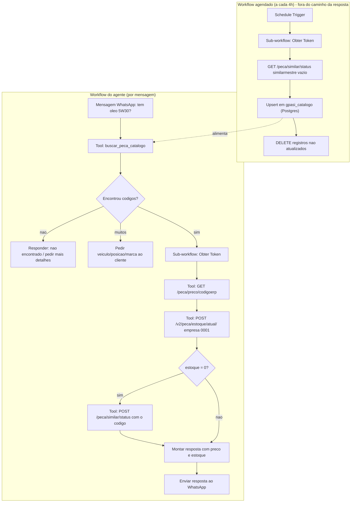

# API GPASI no n8n — Guia de Integração

Guia para quem vai **montar o workflow no n8n**. Não pressupõe conhecimento prévio da API GPASI — cobre autenticação, rotatividade de token, quais endpoints usar (e quais não usar), cURLs prontos e o fluxo completo de ponta a ponta.

Baseado em testes reais contra o ambiente de produção. Detalhes brutos dos testes: `[docs/RELATORIO_TESTE_GPASI_AGENTE.md](RELATORIO_TESTE_GPASI_AGENTE.md)`.

---

## 1. Visão geral

- **API:** Gestão Parts API Suite Integration (GPASI) **4.0.29**
- **Ambiente:** Produção (dados reais da rede Piroli)
- **Base URL:** `http://181.191.194.31:54123`
- **Documentação interativa:** [/docs](http://181.191.194.31:54123/docs) (Swagger) · `/openapi.json` (contrato completo)
- **Autenticação:** OAuth2, *grant type* `password` (usuário e senha viram um token Bearer)
- **Uso previsto:** agente de IA (WhatsApp via n8n) que responde perguntas de peça/preço/estoque


### Modelo de rede: preço único, estoque por loja

A GPASI atende **várias lojas (empresas) da mesma rede Piroli** com uma regra importante:

- **Preço é único para toda a rede.** O endpoint de preço não tem parâmetro de loja — o valor é o mesmo em qualquer filial.
- **Estoque é por loja.** Cada empresa (`0001`, `0003`, `0004`...) tem sua própria quantidade física.

**Decisão de negócio para esta fase:** o agente consulta disponibilidade **somente na loja padrão (matriz** `0001`**)**. Não faz busca simultânea em todas as lojas.

> Guarde esta tabela mesmo sem usá-la agora: existem códigos de empresa que são **espelhos/AUX** de outros, com estoque duplicado. Se um dia o agente evoluir para buscar em "todas as lojas", **não pode somar os 10 códigos** — ver seção 9 (Anexo — Tabela de Lojas). Testado: somar as 10 empresas do SKU `081951` dá 582 unidades, mas o total real das 5 lojas físicas é 291 (o resto é duplicata).

---


## 2. Autenticação e rotatividade do token


### 2.1 Como funciona

- Endpoint: `POST /token`
- Tipo: `application/x-www-form-urlencoded`
- Campos: `username`, `password`, `grant_type=password`
- Resposta:

```json
{
  "access_token": "eyJ0eXAiOiJKV1QiLCJhbGciOiJIUzI1NiJ9...",
  "token_type": "bearer"
}
```

- **Duração do token: 24 horas** (padrão informado pela própria API).
- **Importante:** a resposta **não traz** `expires_in` nem `refresh_token`. Ou seja, o n8n não tem como "saber" pela resposta quando o token vai expirar — isso precisa ser calculado e guardado manualmente no workflow.

Nas credenciais: usuário/senha ficam em `.env` como `User_gestao` / `Senha_gestao`. Não hardcode em nenhum nó do n8n — use uma Credential do tipo "Header Auth" ou variáveis de ambiente do n8n.

### 2.2 Arquitetura recomendada no n8n: sub-workflow de token com cache

Não dá para confiar em nenhum mecanismo de refresh automático nativo (a API não informa expiração). A solução é um **sub-workflow dedicado** chamado, por exemplo, `GPASI - Obter Token`, reaproveitado por todos os outros workflows via nó **Execute Workflow**.

Passo a passo dos nós:

1. **Code node — "Ler cache"**
  Usa `getWorkflowStaticData('global')` para ler `{ access_token, expires_at }` salvos de uma execução anterior.
2. **IF node — "Token válido?"**
  Condição: `expires_at > now` (ainda não expirou).
  - **Verdadeiro** → segue direto para o fim do sub-workflow, devolvendo o `access_token` já em cache (nenhuma chamada HTTP).
  - **Falso** → segue para o passo 3 (reautenticar).
3. **HTTP Request node — "POST /token"**
  Ver cURL na seção 4.1. Corpo `application/x-www-form-urlencoded` com `username`, `password`, `grant_type=password`.
4. **Code node — "Gravar cache"**
  Salva o token recém-obtido com expiração de **23 horas** (1h de margem de segurança em relação às 24h reais):
5. Os workflows que consultam preço/estoque chamam este sub-workflow **antes** de cada HTTP Request à GPASI e usam o `access_token` retornado no header `Authorization: Bearer {{ $json.access_token }}`.

Isso garante: só autentica de novo quando o token expira (ou na primeira execução), sem depender de nada além do relógio do próprio n8n.

### 2.3 O que fazer em caso de 401

Se mesmo com o cache válido a API devolver **401**, é sinal de que o token foi revogado antes do previsto (ex.: senha trocada, sessão invalidada no ERP). Nesse caso: forçar `expires_at = 0` no cache e repetir a chamada uma vez (reautenticando). Se persistir 401, parar e alertar — não tentar em loop.

---


## 3. Endpoints recomendados para o agente


| #   | Método | Path                                | Para quê                                                    | É tool do agente?                                    |
| --- | ------ | ----------------------------------- | ----------------------------------------------------------- | ---------------------------------------------------- |
| 1   | `POST` | `/token`                            | Autenticar                                                  | Não — sub-workflow de token (seção 2)                |
| 2   | `GET`  | `/erpssplus/peca/similar/status`    | Catálogo completo (`codigo` + `descricao`) com `similarmestre: ""` | **Não** — workflow de sync agendado (4.2.1)   |
| 3   | `POST` | `/erpssplus/peca/similar/status`    | Similares de **um código** com `similarmestre: "081951"`    | Sim — tool `consultar_similares` (4.2.2)             |
| 4   | `GET`  | `/erpssplus/peca/preco/{codigoerp}` | Preço de venda (único para toda a rede)                     | Sim — tool `consultar_preco_peca` (4.3)              |
| 5   | `POST` | `/erpssplus/v2/peca/estoque/atual/` | Estoque da loja padrão (`empresa: ["0001"]`), single ou lote | Sim — tool `consultar_estoque_peca` (4.4/4.5)        |
| 6   | `GET`  | `/erpssplus/peca/dados`             | Catálogo enriquecido (`codigofabricante`, `aplicacao`) — lento | Não — sync noturno opcional (4.2.4)               |
| 7   | `GET`  | `/erpssplus/empresa/status`         | Referência da lista de lojas                                | Não — configuração inicial                           |

**A busca por descrição não está nessa tabela porque não existe na GPASI.** Ela é feita numa tabela local sincronizada (seção 4.2.3), exposta ao agente como tool de Postgres. Esse é o ponto que mais gera erro de implementação: tentar usar `peca/similar/status` como busca por nome sempre devolve `[]`.


### Por que `POST /v2/.../estoque/atual/` em vez do `GET /.../estoque/atual/{codigoerp}`?

O `GET` simples (sem informar loja) hoje devolve o mesmo valor da empresa `0001` — mas isso **não está no contrato da API**, é um comportamento observado, não garantido. O `POST` do endpoint v2 aceita `empresa` como lista e permite informar explicitamente `["0001"]`, que é o parâmetro formalmente documentado. Use sempre a versão explícita.

---


## 4. cURLs prontos para o n8n

Nos exemplos abaixo, `{{ }}` está no estilo de expressão do n8n — substitua pelos valores reais das variáveis/credenciais do seu workflow.

### 4.1 Obter token

```bash
curl -sS -X POST 'http://181.191.194.31:54123/token' \
  -H 'Content-Type: application/x-www-form-urlencoded' \
  -d 'username={{ $credentials.gpasi.user }}&password={{ $credentials.gpasi.password }}&grant_type=password'
```

Resposta:

```json
{ "access_token": "***", "token_type": "bearer" }
```


### 4.2 `peca/similar/status` — o que ele faz de verdade

**`similarmestre` não é campo de busca por texto.** No `openapi.json` ele é descrito como *"Código da Peça/Produto Similar (Código do Similar Mestre)"*: espera um **código de produto do ERP**, não uma palavra. Por isso `{"similarmestre":"5W40"}` volta vazio.

Comportamento medido em produção (05/08/2026):

| Body enviado                 | Resultado                                                              |
| ---------------------------- | ---------------------------------------------------------------------- |
| `{"similarmestre":"5W40"}`   | HTTP 200, `[]` — 166 ms (texto livre não é aceito)                     |
| `{"similarmestre":"oleo"}`   | HTTP 200, `[]` — 170 ms                                                |
| `{"similarmestre":"081951"}` | HTTP 200, **16 similares** — 192 ms (código mestre válido)             |
| `{"similarmestre":"075519"}` | HTTP 200, `[]` — código existe, mas não tem similar cadastrado         |
| `{"similarmestre":""}`       | HTTP 200, **109.655 itens** (catálogo inteiro), ~14 MB — ~4,5 s        |

O que confundiu: **a API nunca retorna erro nesse caso.** Parâmetro inválido devolve `200` com lista vazia, igual a "não encontrei nada". `GET` e `POST` funcionam e devolvem exatamente o mesmo resultado.

> **Não existe endpoint de busca por descrição na GPASI.** Varredura em todos os schemas de request do `openapi.json`: nenhum endpoint de peça aceita texto livre como filtro. A busca por nome **tem que ser feita fora da API**, num índice local sincronizado — ver 4.2.3. Isso não é limitação de configuração, é o desenho da API.

#### 4.2.1 Uso válido nº 1 — sync do catálogo completo (`similarmestre: ""`)

```bash
curl -sS 'http://181.191.194.31:54123/erpssplus/peca/similar/status' \
  -H "Authorization: Bearer {{ $json.access_token }}" \
  -H 'Content-Type: application/json' \
  -d '{"similarmestre":""}'
```

- 109.655 itens, ~14 MB, ~4,5 s. Item: `{ "codigo", "descricao", "similarmestre", "ranking", "mestre", "linha" }`.
- Cobre praticamente todo o catálogo (o `/peca/dados` reporta 110 blocos de 1.000 ≈ 110 mil produtos) e só 3 itens vêm com `descricao` vazia.
- **Nunca como tool do agente.** É um workflow de sync agendado (ex.: a cada 4h) que alimenta o índice local.

#### 4.2.2 Uso válido nº 2 — similares de um código conhecido

```bash
curl -sS -X POST 'http://181.191.194.31:54123/erpssplus/peca/similar/status' \
  -H "Authorization: Bearer {{ $json.access_token }}" \
  -H 'Content-Type: application/json' \
  -d '{"similarmestre":"081951"}'
```

Resposta (16 itens para esse código):

```json
[{
  "codigo": "034589",
  "descricao": "OLEO SAE 5W30 API SL SINTETICO FLEX 1L",
  "similarmestre": "081951",
  "ranking": "Média",
  "mestre": "Não",
  "linha": 1
}]
```

Esse é o uso legítimo do endpoint em tempo real: cliente quer **alternativa/equivalente** de uma peça, ou o item pedido está sem estoque e o agente precisa oferecer similar. Latência ~190 ms, então serve como tool. Lembre que `[]` aqui significa "sem similar cadastrado", não erro.

#### 4.2.3 Onde fazer a busca por descrição: índice local no Postgres/Supabase

**Revisão (ago/2026):** montar o índice Redis **nó a nó no n8n** continua inviável (~110k `HSET`). A solução em produção é o script Python na VPS (`gpasi_redis_sync.py` + pipeline Redis, ~24 s) e a API `gpasi-search` para as tools do agente — ver §10.0. Postgres/Supabase permanece alternativa válida se quiser SQL/`ILIKE` em vez de Redis.

**Tabela e índice (rodar uma vez no Supabase):**

```sql
create extension if not exists unaccent;
create extension if not exists pg_trgm;

-- unaccent() é STABLE; o wrapper IMMUTABLE permite usá-la em coluna gerada e índice
create or replace function gpasi_norm(t text)
returns text language sql immutable parallel safe as $$
  select upper(unaccent('unaccent'::regdictionary, coalesce(t, '')))
$$;

create table if not exists gpasi_catalogo (
  codigo         text primary key,
  descricao      text not null,
  similarmestre  text,
  mestre         boolean not null default false,
  busca          text generated always as (gpasi_norm(descricao)) stored,
  atualizado_em  timestamptz not null default now()
);

create index if not exists gpasi_catalogo_busca_trgm
  on gpasi_catalogo using gin (busca gin_trgm_ops);
```

Esse bloco e a query de busca foram **executados no Supabase do projeto** (dentro de transação, revertida em seguida): `unaccent` e `pg_trgm` estão disponíveis, a coluna gerada com o wrapper imutável funciona, e a busca ignora acento e caixa corretamente (`"Óleo 5W40"` acha `ÓLEO SAE 5W40...`).

**Workflow "GPASI - Sync Catálogo"** (Schedule Trigger, a cada 4h):

1. **Schedule Trigger**
2. **Execute Workflow** → `GPASI - Obter Token`
3. **HTTP Request** → cURL de 4.2.1
4. **Code node** → transforma o array numa lista de itens n8n (um item por produto):

```js
const cat = $input.first().json; // array de 109.655 itens
return cat
  .filter((p) => p.codigo && (p.descricao || '').trim())
  .map((p) => ({ json: {
    codigo: String(p.codigo).trim(),
    descricao: p.descricao.trim(),
    similarmestre: p.similarmestre || null,
    mestre: p.mestre === 'Sim',
  } }));
```

5. **Postgres node** → operação **Insert or Update**, tabela `gpasi_catalogo`, *Matching Columns* = `codigo`. Marque também `atualizado_em` para receber `now()` (ou use Execute Query com o upsert abaixo, em lotes de 1.000 via Split In Batches):

```sql
insert into gpasi_catalogo (codigo, descricao, similarmestre, mestre, atualizado_em)
values ($1, $2, $3, $4, now())
on conflict (codigo) do update
  set descricao     = excluded.descricao,
      similarmestre = excluded.similarmestre,
      mestre        = excluded.mestre,
      atualizado_em = now();
```

6. **Postgres node (Execute Query)** — limpar produtos que saíram do catálogo, **no final do sync**:

```sql
delete from gpasi_catalogo where atualizado_em < now() - interval '30 minutes';
```

Esse padrão de upsert + limpeza evita o índice "sujo" (produto descontinuado continuar aparecendo) **sem downtime** — em nenhum momento a tabela fica vazia para o agente.

**Query de busca usada pelo agente** (`$1` = termo do cliente, ex.: `"oleo 5w30"`):

```sql
select codigo, descricao, mestre
from gpasi_catalogo
where busca like all (
  array(
    select '%' || w || '%'
    from unnest(string_to_array(gpasi_norm($1), ' ')) as w
    where w <> ''
  )
)
order by mestre desc, length(descricao)
limit 20;
```

Ela exige **todas** as palavras do termo na descrição (`AND`), ignora acento e caixa, e prioriza produtos mestres. Resultados reais desse filtro no catálogo sincronizado:

| Termo do cliente  | Itens encontrados | Exemplo                                                 |
| ----------------- | ----------------- | ------------------------------------------------------- |
| `5W40`            | 13 (3 mestres)    | `OLEO SAE 5W40 API SN SELENIA PERFORM SINTETICO FLEX 1L` |
| `5W30`            | 25 (8 mestres)    | `OLEO SAE 5W30 API SN BRUTUS SINTETICO DIESEL 1L`        |
| `pastilha freio`  | 1.504 (615)       | `PASTILHA FREIO DT`                                     |
| `filtro oleo`     | 615 (314)         | `FILTRO OLEO LUBRIFICANTE`                              |

Como "pastilha freio" traz 1.504 itens, o agente **não pode** listar tudo: o `limit 20` + a orientação de pedir mais detalhes (veículo, posição, marca) estão no prompt da tool na seção 10.

#### 4.2.4 Fonte alternativa de sync: `/peca/dados` (mais campos, muito mais lenta)

O relatório antigo registrou esse endpoint como "retorna sempre `[]`". **Estava errado: o `bloco` começa em 1, não em 0.** Com `bloco: 0` a resposta é `[]`; com `bloco: 1` vêm os dados.

```bash
curl -sS 'http://181.191.194.31:54123/erpssplus/peca/dados' \
  -H "Authorization: Bearer {{ $json.access_token }}" \
  -H 'Content-Type: application/json' \
  -d '{"bloco":1}'
```

Resposta: `[{ "totalblocos": 110, "blocoatual": 1, "pecas": [...] }]` — 1.000 produtos por bloco, **110 blocos**.

Traz campos que o `similar/status` não tem e que são valiosos para o agente: `codigofabricante` (part number), `codigobarras`, `marca`, `aplicacao` (aplicação veicular em texto: *"VW.PASSAT 1.5 1.6 TODOS / POSIÇÃO: DIANTEIRA..."*), `pesquisa1..6`, `ncm`, `dadostecnicos`, `grupo`/`subgrupo`/`secao`.

**O problema é a latência: 29 s a 57 s por bloco.** 110 blocos ≈ **1 a 1,5 hora** de sync. Conclusão prática:

- **Sync de hora em hora / busca do dia a dia** → `similar/status` (4,5 s para tudo).
- **Sync noturno enriquecedor (1x/dia, opcional)** → `/peca/dados` paginado, para adicionar `codigofabricante` e `aplicacao` na mesma tabela. Isso habilita o cliente buscar por part number (ex.: "P17") e cruzar peça × veículo sem depender do TecDoc.


### 4.3 Consultar preço por código

```bash
curl -sS 'http://181.191.194.31:54123/erpssplus/peca/preco/{{ $json.codigoerp }}' \
  -H "Authorization: Bearer {{ $json.access_token }}"
```

Resposta:

```json
[{
  "codigoerp": "081951",
  "preco": 59.64,
  "custo": 33.89,
  "precoatacado": 55.08,
  "precoecommerce": 59.64
}]
```

O `codigoerp` vai **no path**, nunca em query string. Configuração como tool do agente: seção 10.

### 4.4 Consultar estoque na loja padrão — um código

```bash
curl -sS -X POST 'http://181.191.194.31:54123/erpssplus/v2/peca/estoque/atual/' \
  -H "Authorization: Bearer {{ $json.access_token }}" \
  -H 'Content-Type: application/json' \
  -d '{"codigoerp":["{{ $json.codigoerp }}"],"empresa":["0001"]}'
```

Resposta:

```json
[{
  "codigoerp": "081951",
  "estoque": 96.0,
  "estoquereservado": 0.0,
  "custo": 33.89
}]
```


### 4.5 Consultar estoque na loja padrão — vários códigos de uma vez

Útil quando a busca por descrição (seção 4.2) retorna mais de um SKU candidato — consulta todos numa chamada só.

```bash
curl -sS -X POST 'http://181.191.194.31:54123/erpssplus/v2/peca/estoque/atual/' \
  -H "Authorization: Bearer {{ $json.access_token }}" \
  -H 'Content-Type: application/json' \
  -d '{"codigoerp":["081951","081952","078937"],"empresa":["0001"]}'
```

**Atenção:** se você colocar mais de um código em `empresa` (ex. `["0001","0003"]`), a API **soma o estoque das duas lojas num único número** — não devolve por loja. Para este fluxo (loja padrão), sempre mande só `["0001"]`.

---


## 5. Fluxo completo — passo a passo

Exemplo real testado: cliente pergunta "tem óleo 5W30?".


| Passo | Ação                                                                    | Resultado                                                                                            |
| ----- | ----------------------------------------------------------------------- | ---------------------------------------------------------------------------------------------------- |
| 1     | Cliente manda a pergunta no WhatsApp                                    | "tem óleo 5W30?"                                                                                     |
| 2     | Agente chama a tool `buscar_peca_catalogo` (Data Tables na demo; Postgres em produção) | 25 produtos combinam; agente pega os mestres primeiro                                  |
| 3     | Sub-workflow de token entrega o `access_token` (cache ou novo)          | token válido, sem nova autenticação                                                                  |
| 4     | Agente chama `consultar_preco_peca` com o código escolhido (4.3)        | `081951` → R$ 59,64                                                                                  |
| 5     | Agente chama `consultar_estoque_peca` na loja `0001` (4.4/4.5)          | 96 unidades                                                                                          |
| 6     | Agente monta a resposta                                                 | "Temos OLEO SAE 5W30 API SP SELENIA PERFORM SINTETICO FLEX 1L por R$ 59,64, 96 unidades disponíveis" |

O sync do catálogo **não faz parte desse caminho** — roda em paralelo, no seu próprio agendamento.



---


## 6. Endpoints avaliados e descartados

Para não reabrir essa discussão depois — todos foram testados e o motivo do descarte está documentado.


| Endpoint                                                                                                                                                                                                                                           | Motivo do descarte                                                                                                                                                                                                                                 |
| -------------------------------------------------------------------------------------------------------------------------------------------------------------------------------------------------------------------------------------------------- | -------------------------------------------------------------------------------------------------------------------------------------------------------------------------------------------------------------------------------------------------- |
| ~~`GET /erpssplus/peca/dados`~~ **— reavaliado, funciona**                                                                                                                                                                                         | O `[]` do teste anterior foi causado por `bloco: 0`. Com `bloco: 1..110` retorna 1.000 produtos por bloco, com `codigofabricante`, `aplicacao` e mais. Descartado apenas para uso em tempo real (29–57 s por bloco); aproveitável como sync noturno — ver 4.2.4 |
| `POST /erpssplus/peca` (verificar existência por descrição)                                                                                                                                                                                        | Sem o campo `veiculo` preenchido dá erro **500**; com `veiculo` preenchido devolve `[]` — não confiável                                                                                                                                            |
| `GET /erpssplus/peca/tabela/preco/` e `GET /erpssplus/peca/preco/` (variante em lote com filtros)                                                                                                                                                  | Retornam `[]` neste tenant — usar sempre `GET /peca/preco/{codigoerp}`                                                                                                                                                                             |
| `GET /erpssplus/peca/veiculo` e `GET /erpssplus/peca/veiculo/placa/`                                                                                                                                                                               | A própria API responde: *"Endpoint necessita de liberação comercial, entre em contato com seu representante"*                                                                                                                                      |
| Tudo em `pedido`, `wms`, `crm`, `financeiro`, `fiscal`, `contabil`, `compra`, `entradas`, `saidas`, `integradora`, `webhook`, `pessoas`, `fornecedor`, `transportador`, `vendedor`, `servico`, `logistica`, `pagamento`, `operacao-coi`, `usuario` | Fora do escopo de um agente de consulta — são operações de escrita (pedidos, movimentações, cadastros) ou domínios não relacionados a peça/preço/estoque. Usar esses endpoints em produção sem necessidade pode criar/alterar/cancelar dados reais |
| `GET /erpssplus/peca/estoque/atual/ALL` e `GET /erpssplus/peca/preco/ALL`                                                                                                                                                                          | Funcionam, mas devolvem o catálogo inteiro (~4–14 MB, 4–5 s) — só fazem sentido para sync/cache administrativo, nunca dentro do fluxo de resposta ao cliente                                                                                       |


---


## 7. Erros comuns e tratamento


| Situação                                | Como identificar                                                     | O que fazer                                                                                         |
| --------------------------------------- | -------------------------------------------------------------------- | --------------------------------------------------------------------------------------------------- |
| **Resposta `200` com `[]`**              | Qualquer endpoint de peça devolvendo lista vazia sem mensagem de erro | A GPASI **não valida parâmetro**: filtro inválido e "não encontrei" retornam o mesmo `200 []`. Antes de suspeitar de indisponibilidade, confira se o campo recebeu o tipo certo (ex.: `similarmestre` exige código, não texto — seção 4.2) |
| Token expirado                          | HTTP `401` em qualquer chamada autenticada                           | Zerar cache do token e reautenticar uma vez (seção 2.3); não repetir em loop                        |
| Código não encontrado / zerado          | HTTP `200` com `codigoerp: ""` ou `estoque: 0` / `preco: 0` no corpo | Validar se o `codigoerp` da resposta é igual ao solicitado antes de exibir o valor                  |
| Nenhum produto bate com a descrição     | Query em `gpasi_catalogo` volta zero linhas                          | Responder que não achou e sugerir reformular com menos palavras (ex.: "pastilha freio")             |
| Vários produtos batem com a descrição   | Query retorna muitas linhas (ex.: 1.504 para "pastilha freio")       | Não listar tudo: mostrar até 5 e pedir veículo/ano/posição/marca para refinar (prompt em 10.1)      |
| Tabela `gpasi_catalogo` vazia/desatualizada | Busca por descrição não acha nada que deveria achar               | Verificar o workflow de sync (4.2.3): se ele falhar, o `DELETE` de limpeza não roda e o catálogo simplesmente envelhece — monitorar `max(atualizado_em)` |
| Latência alta em `/peca/similar/status` | Chamada demorando vários segundos                                    | Esperado (~4,5 s) — por isso é sync/cache, não parte do caminho de resposta em tempo real           |


### Latências de referência (medidas em produção)


| Endpoint                                      | Latência típica |
| --------------------------------------------- | --------------- |
| `POST /token`                                 | ~350 ms         |
| `GET /peca/preco/{codigoerp}`                 | ~180–230 ms     |
| `POST /v2/peca/estoque/atual/`                | ~180–230 ms     |
| `POST /peca/similar/status` (similares de 1 código) | ~190 ms   |
| `GET /peca/similar/status` (sync completo)    | ~4,5 s          |
| `GET /peca/estoque/atual/ALL` (sync completo) | ~5,3 s          |
| `GET /peca/dados` (1 bloco de 1.000)          | **29–57 s**     |


---


## 8. Riscos gerais

1. **HTTP sem TLS** na porta pública `54123` — token e senha trafegam sem criptografia. Considerar VPN/tunelamento se possível.
2. **Ambiente é produção real** — qualquer chamada de escrita (pedidos, cancelamentos, ajustes de estoque) afeta o ERP de verdade. O agente deve ficar restrito aos endpoints da seção 3.
3. **Token de 24h sem** `expires_in` — a margem de segurança de 1h (seção 2.2) é uma estimativa; se a API mudar a duração real do token sem avisar, ajustar o valor de `23 * 60 * 60 * 1000` no Code node.
4. `similar/status` **é pesado** — mantenha o sync fora do caminho crítico de resposta ao WhatsApp.
5. **A API não valida parâmetros:** devolve `200 []` para filtro inválido, exatamente como para "não encontrei". Qualquer tool nova precisa ser testada com um valor que você *sabe* que existe, senão o erro passa silencioso (foi o que aconteceu com `similarmestre: "5W40"`).
6. **A busca por descrição depende do sync.** Se o workflow de sync parar, o agente continua respondendo — com catálogo velho. Vale um alerta se `max(atualizado_em)` de `gpasi_catalogo` passar de algumas horas.

---


## 9. Anexo — Tabela de lojas (empresas)

Referência para o futuro. **Não usada na busca do agente hoje** (que consulta só `0001`).


| Código | Fantasia                         | CNPJ           | Classificação                                 |
| ------ | -------------------------------- | -------------- | --------------------------------------------- |
| `0001` | PIROLI MATRIZ 0001               | 15389901000194 | Loja física real                              |
| `0003` | PIROLI FILIAL 0003               | 15389901000356 | Loja física real                              |
| `0004` | PIROLI FILIAL 0004               | 15389901000437 | Loja física real                              |
| `0005` | PIROLI FILIAL 0005               | 15389901000518 | Loja física real                              |
| `0010` | PIROLI PECAS E SERVICOS MECANICO | 32561159000171 | Loja física real                              |
| `1001` | PIROLI AUX 1001                  | 00000000000000 | Espelho de `0001` (estoque idêntico, testado) |
| `1010` | PIROLI PECAS E SERVICOS MECANICO | 00000000000000 | Espelho/duplicata de `0010`                   |
| `3003` | PIROLI AUX 3003                  | 00000000000000 | Código auxiliar (CNPJ fictício)               |
| `4004` | PIROLI AUX 4004                  | 00000000000000 | Espelho de `0004` (estoque idêntico, testado) |
| `5005` | PIROLI AUX 5005                  | 00000000000000 | Espelho de `0005` (estoque idêntico, testado) |


**Se um dia o agente evoluir para "buscar em todas as lojas e dizer onde tem"**: usar só as 5 lojas físicas reais (`0001`, `0003`, `0004`, `0005`, `0010`), consultando **uma chamada por loja** (o endpoint em lote soma quando recebe várias empresas — não devolve por loja). Nunca incluir os códigos espelho/AUX no cálculo, ou o total de estoque fica dobrado.

---

## 10. Tools do AI Agent — configuração e prompts prontos

Produção usa **Redis na VPS** como espelho do catálogo + preços GPASI, com busca via microserviço interno. Estoque continua live na GPASI. Catálogos de fornecedor (Supabase `produtos`) entram como **fallback** no mesmo `/search` — sem espelhar no Redis e sem o n8n chamar o PostgREST. Placa e TecDoc ficam como tools complementares.

### 10.0 Produção — Redis + `gpasi-search` (recomendado)

**Provisionado em `n8n.autopecas.tech` / VPS `31.97.93.135`:**

| Recurso | Detalhe |
| --- | --- |
| Redis | container `tecdoc_redis` (rede `easypanel`), prefixo `gpasi:` |
| Search API | container `gpasi-search:8080` — `GET /health`, `/search`, `/peca/{codigo}` (v1.3+ STRICT) |
| Sync script | `/opt/gpasi-sync/gpasi_redis_sync.py` (`--catalog` / `--prices` / `--enrich` / `--full`) |
| Timers | catalog **6h**; prices **30min**; enrich **1 bloco a cada 30min** até completar (`gpasi-redis-enrich.timer`) |
| Workflows | [AgentePiroli 2.0](https://n8n.autopecas.tech/workflow/5tDjyath0Vpq80Cf) (WA) · [Agente com LLM local](https://n8n.autopecas.tech/workflow/8V2xfDI88pTQzuJi) |
| Bateria tools (local) | [`RELATORIO_BATERIATEST_AGENTE_LOCAL.md`](RELATORIO_BATERIATEST_AGENTE_LOCAL.md) (baseline 4,5) · V2 [`RELATORIO_BATERIATEST_AGENTE_LOCAL_V2.md`](RELATORIO_BATERIATEST_AGENTE_LOCAL_V2.md) (**8,7/10**) · plano [`PLANO_AGENTE_SCORE8.md`](PLANO_AGENTE_SCORE8.md) |
| Demo Data Table (legado) | [GPASI Demo](https://n8n.autopecas.tech/workflow/1Wi23moXapo99nwt) + table `lGiFKdQjvZdq465F` |

```text
systemd timers (VPS)
  → docker gpasi-sync --catalog (6h) | --prices (30min) | --enrich (diário)
  → Redis gpasi:peca:* + gpasi:tok:* + gpasi:visc:* + gpasi:aplic:*

Chat n8n
  → AI Agent
      → buscar_peca_catalogo?q=&modelo=s10 2.8 diesel → STRICT (tok ∩ aplic)
           sem modelo e ERP vazio → RPC buscar_produtos_agente (Supabase)
           COM modelo → NUNCA Supabase automático
      → consultar_preco / estoque → GPASI live (só fonte=gpasi)
```

**Cascata com `modelo` (v1.4):** o `/search` valida a aplicação no servidor — o agente nunca precisa "conferir na GPASI":

| Camada | Como | Quando responde |
| --- | --- | --- |
| **L1 `strict`** | `gpasi:tok:{peça}` ∩ `gpasi:aplic:{veículo}` (índice) + validação do texto | índice aplic cobre a peça |
| **L2 `soft_aplic`** | só `gpasi:tok` + validação do texto de `aplicacao` no hash (modelo principal presente, anti-moto) | índice parcial (enrich em andamento) |
| **miss** | `status=miss`, `retry=false`, hint de alívio de escopo | nada compatível — agente: 1 clarificação + máx 1 rebusca aliviada |

Campo `layer` no JSON informa a camada. Com `modelo`, **nunca** cai em Supabase/fornecedor (era a origem das pastilhas de moto). Busca por texto em tempo real na GPASI **não existe** neste tenant: `POST /peca` devolve `[]` para tudo; fluxo por placa (`/veiculo/`, `v2/peca/veiculo/placa/`) exige liberação comercial (testado com placa real em 12/08).

**Enrich (`--enrich`):** `GET /erpssplus/peca/dados` por **grupo+bloco** (`{"bloco":B,"grupo":"0001"}`). `{"bloco":N}` puro devolve `[]` neste tenant. Grupos via `GET /peca/grupo/status` (~261). Grava no hash: `aplicacao`, `marca`, `codigofabricante`, `codigobarras`, `grupo`/`subgrupo`/`secao`, `ncm`, `pesquisa1..6`, `dadostecnicos` (cap), `enrich_updated_at`. Rebuild contínuo de `gpasi:aplic:{tok}` (motor `\d+\.\d+` preservado). Catalog **não** apaga `aplic:*`. Merge **idempotente** (HSET + SADD; contadores só sobem se a peça ainda não tinha `aplicacao`/`enrich_updated_at`). Checkpoint: `enrich_grupo` + `enrich_grupo_bloco` (`enrich_next_bloco=g0001:b13` no /health).

**Modo batch (timer 30min):** `--enrich-batch 1` = **1 bloco por tick**. Soft-throttle (`[]`): cursor **intacto**, retry no próximo tick — **não** pula bloco (perderia peças) e **não** limpa `gpasi:aplic:*`. Pós-full: `enrich_updated_at` + no-op nos ticks.

**Soft-throttle GPASI:** `/peca/dados` pode devolver `[]` (~60–240s) sob carga. Batch: 2 tentativas + backoff; se persistir, sai 0 e o timer de 30min retenta o mesmo cursor. O unit para catalog/prices durante o bloco e faz `docker rm -f` do container anterior (evita Conflict 125).

**Fallback Supabase:** só sem `modelo` (ou `fonte=fornecedor` explícito) quando o ERP não tem candidato de peça. Service role só no `gpasi-search`.

**Schema Redis**

| Key | Tipo |
| --- | --- |
| `gpasi:peca:{codigo}` | HASH (descricao, viscosidade, preços, aplicacao, marca, codigofabricante, …) |
| `gpasi:tok:{token}` | SET de códigos (tokens de descrição) |
| `gpasi:visc:{5W40}` | SET (equals) |
| `gpasi:aplic:{token}` | SET de códigos (tokens de aplicação veicular) |
| `gpasi:meta:*` | catalog/price/enrich timestamps, `aplicacao_coverage`, `aplic_token_count` |

Catalog+preços: ~110k hashes, ~50 MB base. Enrich + `aplic:*`: +~100–250 MB (validar `INFO memory`).

**Tools do agente**

1. `buscar_por_viscosidade` → `GET …/search?viscosidade=&limit=3`
2. `buscar_peca_catalogo` → `GET …/search?q=&modelo=&catalogo=&fonte=&limit=3` — `modelo` = escopo veicular (`s10 2.8 diesel`)
3. `consultar_preco_peca` → só após `fonte=gpasi` com preco vazio
4. `consultar_estoque_peca(01/04/05)` → só `fonte=gpasi`; loja do cliente primeiro
5. `ConsultaPlaca` / `Consulta TecDoc` (TecDoc: 1 termo EN, só no miss)

**Teto de tools/turno:** 1 busca; TecDoc ≤1; `maxIterations=4`; timeout=miss; nunca mensagem vazia.

Scripts: [`scripts/gpasi_redis_sync.py`](../scripts/gpasi_redis_sync.py), [`scripts/gpasi_search_api.py`](../scripts/gpasi_search_api.py), units em [`scripts/systemd/`](../scripts/systemd/) (inclui `gpasi-redis-enrich.*`).

### 10.0b Modo demonstração legado — n8n Data Tables

Ainda disponível para referência rápida sem Redis:

| Recurso | ID / link |
| --- | --- |
| Data Table `gpasi_catalogo` | `lGiFKdQjvZdq465F` (~109.654 linhas) |
| Workflow sync | [GPASI - Carregar catálogo demo](https://n8n.autopecas.tech/workflow/YCHaFBHvBTJE00MP) |
| Workflow agente demo | [GPASI Demo - Busca 5W40 preço estoque](https://n8n.autopecas.tech/workflow/1Wi23moXapo99nwt) |

```text
Workflow manual de carga (executado uma vez)
GPASI similar/status vazio → normalizar → Data Table gpasi_catalogo

Workflow do chat
AI Agent → tool buscar_peca_catalogo → Data Tables API search
         → tool consultar_preco_peca
         → tool consultar_estoque_peca
```

#### A. Criar a tabela

Em **Data tables → Create Data table → From scratch**, crie `gpasi_catalogo`:

| Coluna          | Tipo    |
| --------------- | ------- |
| `codigo`        | String  |
| `descricao`     | String  |
| `similarmestre` | String  |
| `ranking`       | String  |
| `mestre`        | Boolean |
| `linha`         | Number  |
| `viscosidade`   | String  | extraída da descrição (`5W40`, `15W40`…) |
| `aplicacao`     | String  | compatibilidade veicular (texto do ERP) |
| `marca`         | String  | marca no ERP |
| `codigofabricante` | String | part number / código fabricante |

#### B. Workflow manual `GPASI - Carregar catálogo demo`

1. **Manual Trigger**.
2. Nó que fornece o token já usado no fluxo.
3. **HTTP Request** normal (não Tool):
   - Method: `GET`
   - URL: `http://181.191.194.31:54123/erpssplus/peca/similar/status`
   - Header: `Authorization: Bearer {{ $json.value }}`
   - Send Body: ON, JSON: `{"similarmestre":""}`
4. **Code** — converte o array em itens:

```js
const input = $input.first().json;
const catalogo = Array.isArray(input)
  ? input
  : (input.body ?? input.response ?? []);

if (!Array.isArray(catalogo)) {
  throw new Error('A GPASI não retornou um array de produtos');
}

return catalogo
  .filter((p) => p.codigo && String(p.descricao || '').trim())
  .map((p) => ({
    json: {
      codigo: String(p.codigo).trim(),
      descricao: String(p.descricao).trim(),
      similarmestre: String(p.similarmestre || ''),
      ranking: String(p.ranking || ''),
      mestre: p.mestre === 'Sim',
      linha: Number(p.linha || 0),
    },
  }));
```

5. Para a demo, antes da recarga use **Data Table → Row → Delete/Clear all rows**.
6. **Data Table → Row → Insert**:
   - Table: `gpasi_catalogo`
   - Mapping: **Map Automatically**
   - Options → **Optimize Bulk: ON**

Execute esse workflow uma vez. Depois confira na aba Data Tables se existem linhas como `5W40`. A carga não deve estar conectada ao AI Agent: ela é manutenção, não uma tool.

#### C. Tools de busca no Data Table

O `ilike` em `descricao` com termo `5W40` também encontra `15W40`, porque `5W40` é substring de `15W40`. Por isso o catálogo tem a coluna **`viscosidade`** e, para peças genéricas, a coluna **`aplicacao`** (compatibilidade veicular vinda de `GET /peca/dados`).

**1) `buscar_por_viscosidade`** — Data Table Tool
- Coluna: `viscosidade` · Condição: **Equals**
- Valor: `{{ $fromAI('viscosidade', 'Ex.: 5W40', 'string') }}`
- Uso: `"quero óleo 5W40"` → só 5W40

**2) `buscar_peca_catalogo`** — Data Table Tool (descrição + veículo)
- Condições **AND**:
  - `descricao` **ilike** `termo` (ex.: `PASTILHA FREIO`)
  - `aplicacao` **ilike** `modelo` (ex.: `GOL`, `S10`, `CIVIC`)
- Se o cliente não informar o veículo, o agente **pergunta** antes de buscar (evita pastilha aleatória).
- A coluna `aplicacao` é populada pelo script `scripts/gpasi_enrich_aplicacao.py` a partir dos 110 blocos de `/erpssplus/peca/dados` (~30–60 s/bloco).

**Teste esperado:**

```text
Cliente: "Tem pastilha de freio para Gol?"
1. buscar_peca_catalogo(termo="PASTILHA FREIO", modelo="GOL")
2. confere aplicacao (ex.: VW.GOL 1.0 ...)
3. preço + estoque
4. responde peça compatível + R$ + estoque
```

### 10.1 `buscar_peca_catalogo` — versão de produção com Postgres Tool

Nó: **Postgres Tool** → operação *Execute Query*. A query é fixa (o modelo só preenche o termo), o que evita SQL livre gerado pelo LLM:

```sql
select codigo, descricao, mestre
from gpasi_catalogo
where busca like all (
  array(
    select '%' || w || '%'
    from unnest(string_to_array(gpasi_norm($1), ' ')) as w
    where w <> ''
  )
)
order by mestre desc, length(descricao)
limit 20;
```

Parâmetro `$1` = `{{ $fromAI('termo', 'Termo de busca em português, como o cliente falou. Ex: oleo 5w30, pastilha freio dianteira') }}`

```text
Busca peças no catálogo da Piroli pelo NOME/DESCRIÇÃO em português e devolve o código interno (codigo) de cada peça encontrada.

QUANDO USAR:
- SEMPRE que o cliente descrever uma peça por nome (ex.: "óleo 5w30", "pastilha de freio", "filtro de óleo").
- Use ANTES de consultar preço ou estoque: essas duas tools exigem o codigo, que só sai daqui.
- Esta é a única forma de descobrir o código. NUNCA invente ou adivinhe um código.

COMO CHAMAR:
- Passe o termo em PORTUGUÊS, do jeito que o cliente falou. Este catálogo é o do ERP e está em português.
- NÃO traduza para inglês (isso vale só para a tool do TecDoc).
- Use apenas as palavras que descrevem a peça. Ex.: cliente diz "vc tem oleo 5w30 aí?" -> termo = "oleo 5w30".
- Prefira 2 a 3 palavras. Termos longos demais reduzem os resultados a zero.
- Se voltar vazio, tente de novo com menos palavras (ex.: "pastilha freio" em vez de "pastilha de freio dianteira original").

COMO LER A RESPOSTA:
- Cada linha tem: codigo (código interno ERP), descricao, mestre.
- mestre = true indica o item principal da família de similares: prefira esses ao sugerir.
- Se vier 1 resultado: siga direto para preço e estoque.
- Se vier de 2 a 5: mostre as opções ao cliente com a descrição e pergunte qual ele quer.
- Se vier mais de 5 (ex.: "pastilha freio" traz mais de 1.000): NÃO liste tudo. Pergunte o veículo (modelo e ano), a posição (dianteira/traseira) ou a marca para refinar, e busque de novo com o termo mais específico.
- Se vier vazio: diga que não encontrou e peça para o cliente descrever de outra forma.
```

### 10.2 `consultar_preco_peca` — HTTP Request Tool

**Method:** GET · **URL:** *Defined automatically by the model*

```text
Consulta o preço de venda de uma peça no ERP Gestão Parts (GPASI).

QUANDO USAR:
- Só depois de já ter o codigo da peça (vindo de buscar_peca_catalogo).
- Quando o cliente perguntar preço, valor, quanto custa, ou junto com disponibilidade.

COMO CHAMAR (obrigatório):
- Método: GET
- Monte a URL exatamente neste formato, trocando {codigo} pelo código da peça (mantenha os zeros à esquerda, ex.: 075519):
  http://181.191.194.31:54123/erpssplus/peca/preco/{codigo}
- Exemplo correto: http://181.191.194.31:54123/erpssplus/peca/preco/075519
- NÃO use query string (?codigo=...). O código vai SEMPRE no fim do path.
- Uma peça por chamada. Para vários códigos, chame a tool várias vezes.

COMO LER A RESPOSTA:
- Vem um array; use o primeiro item.
- preco = preço de venda ao consumidor (use este por padrão).
- precoatacado = só se o cliente pedir atacado. precoecommerce = preço do site.
- NUNCA informe o campo custo ao cliente: é custo interno da loja.
- Responda em reais com 2 casas decimais. O preço é o mesmo em todas as lojas da rede.
```

### 10.3 `consultar_estoque_peca` — HTTP Request Tool

**Method:** POST · **URL fixa:** `http://181.191.194.31:54123/erpssplus/v2/peca/estoque/atual/` · **Send Body:** ON (JSON)

Body com o código preenchido pelo modelo:

```json
{
  "codigoerp": ["{{ $fromAI('codigo', 'Código interno ERP da peça, ex: 081951') }}"],
  "empresa": ["0001"]
}
```

```text
Consulta quantas unidades de uma peça existem em estoque na loja matriz (0001) da Piroli.

QUANDO USAR:
- Só depois de já ter o codigo da peça (vindo de buscar_peca_catalogo).
- Sempre que o cliente perguntar se "tem", se está disponível, ou quantas unidades.
- Consulte estoque JUNTO com o preço antes de afirmar que a peça está disponível.

COMO CHAMAR:
- Informe apenas o codigo da peça. A loja é sempre a matriz 0001 e já está fixa na requisição.
- NÃO invente código.

COMO LER A RESPOSTA:
- Vem um array; use o primeiro item.
- estoque = quantidade disponível na loja 0001.
- estoquereservado = já comprometido com outros pedidos; se estoque for baixo, mencione com cautela.
- NUNCA informe o campo custo ao cliente.
- Confira se o codigoerp da resposta é igual ao que você pediu antes de responder.
- Se estoque for 0: diga que está em falta na loja e use consultar_similares para oferecer equivalentes.
- O estoque é só da matriz 0001. Não afirme nada sobre outras lojas.
```

### 10.4 `consultar_similares` — HTTP Request Tool

**Method:** POST · **URL fixa:** `http://181.191.194.31:54123/erpssplus/peca/similar/status` · **Send Body:** ON (JSON)

```json
{ "similarmestre": "{{ $fromAI('codigo', 'Código interno ERP da peça mestre, ex: 081951') }}" }
```

```text
Lista peças similares/equivalentes a uma peça específica no ERP da Piroli.

QUANDO USAR:
- Quando a peça pedida estiver com estoque 0 e você precisar oferecer alternativa.
- Quando o cliente pedir opção mais barata, equivalente ou de outra marca.

COMO CHAMAR (muito importante):
- O campo similarmestre aceita SOMENTE o código interno ERP da peça (ex.: 081951).
- NUNCA passe texto/descrição aqui (ex.: "5W40", "oleo", "pastilha"). Texto sempre retorna lista vazia.
- Para descobrir o código a partir do nome, use buscar_peca_catalogo primeiro.

COMO LER A RESPOSTA:
- Cada item tem codigo, descricao e ranking (qualidade do similar).
- Lista vazia significa "esta peça não tem similar cadastrado", NÃO significa erro.
- Para cada similar que for oferecer, consulte preço e estoque antes de prometer disponibilidade.
```

### 10.5 Prompt do agente principal (revisado)

Ajustes em relação ao prompt atual: inclui as tools do GPASI, separa **catálogo GPASI (português)** de **TecDoc (inglês)** — a regra "traduza para inglês" hoje é global e faria o agente buscar "Oil Filter" no catálogo em português —, e fixa a ordem código → preço → estoque.

```text
Você é o Piroli, especialista em autopeças e assistente virtual da rede Piroli. Seu objetivo é ajudar o cliente a encontrar a peça correta, informar preço e dizer se temos em estoque.

SUAS FERRAMENTAS:
1. ConsultaPlaca — dados do veículo (marca, modelo, ano) a partir de uma placa.
2. Consulta TecDoc — catálogo técnico de referência, EM INGLÊS, para identificar a peça por veículo.
3. buscar_peca_catalogo — catálogo de VENDA da Piroli, EM PORTUGUÊS. Na demo consulta Data Tables; em produção pode consultar Postgres. Devolve o codigo interno do ERP.
4. consultar_preco_peca — preço de venda, exige o codigo.
5. consultar_estoque_peca — estoque na loja matriz 0001, exige o codigo.
6. consultar_similares — equivalentes de um codigo, para quando faltar estoque.

REGRA DE IDIOMA (não confunda as duas bases):
- Consulta TecDoc: traduza a peça para INGLÊS ("filtro de óleo" -> "Oil Filter", "pastilha de freio" -> "Brake Pad").
- buscar_peca_catalogo: use PORTUGUÊS, como o cliente falou ("filtro de oleo", "pastilha freio"). Nunca traduza aqui.

ORDEM OBRIGATÓRIA PARA PREÇO E ESTOQUE:
Passo 1: obtenha o codigo com buscar_peca_catalogo.
Passo 2: consultar_preco_peca com esse codigo.
Passo 3: consultar_estoque_peca com esse codigo.
Passo 4: responda preço e disponibilidade juntos.
Nunca invente ou deduza um codigo, e nunca afirme preço ou disponibilidade sem ter chamado as tools.

QUANDO O CLIENTE MANDA PLACA + PEÇA (ex.: "tem pastilha de freio para a placa PAN0161?"):
Passo 1: ConsultaPlaca para descobrir o veículo.
Passo 2: extraia o modelo principal (se vier "CHEVROLET/S10 ADV", use "S10").
Passo 3: busque no catálogo Piroli com buscar_peca_catalogo em português (ex.: "pastilha freio").
Passo 4: se vierem muitos resultados, use o modelo/ano do veículo e a posição (dianteira/traseira) para refinar, ou consulte o TecDoc em inglês para confirmar a peça correta.
Passo 5: preço e estoque do código escolhido.

CÓDIGO NUMÉRICO INFORMADO PELO CLIENTE (ex.: 25206966):
- Trate como referência/part number, nunca como modelo de veículo.
- Códigos internos do ERP Piroli têm 6 dígitos e podem ter zero à esquerda (ex.: 075519) — preserve os zeros.

MUITOS RESULTADOS:
- Termos genéricos trazem centenas de itens ("pastilha freio" traz mais de 1.000). Não liste tudo.
- Mostre no máximo 5 opções ou pergunte veículo, ano, posição e marca para refinar.

SEM ESTOQUE:
- Se estoque = 0, diga com clareza e use consultar_similares para oferecer equivalentes (checando preço e estoque de cada um).

LIMITES:
- O estoque consultado é o da loja matriz (0001). Não afirme nada sobre outras lojas.
- O preço é único para toda a rede.
- Nunca revele o campo custo.
- Se as tools não acharem a peça, seja honesto e ofereça encaminhar para um vendedor.

Seja direto, simpático e prático, como um balconista experiente de autopeças. Ao encontrar a peça, informe descrição, preço, disponibilidade e se coloque à disposição.
```