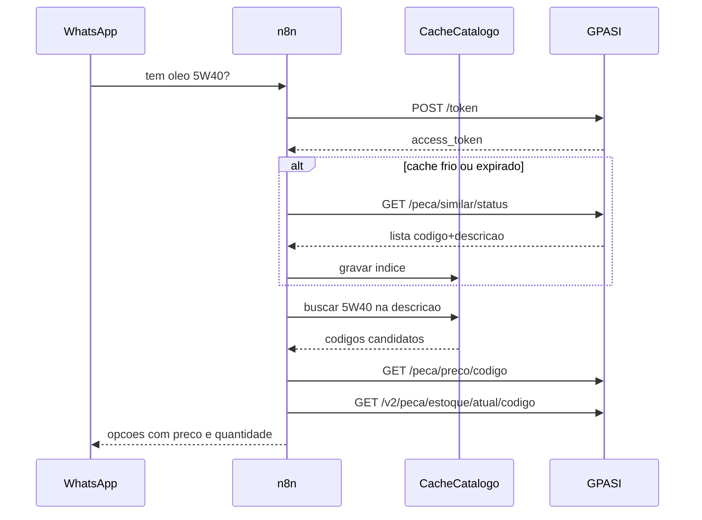

# Relatório — Teste GPASI (Gestão Parts) para agente n8n

**Data:** 2026-08-04  
**API:** Gestão Parts API Suite Integration (GPASI) **4.0.29**  
**Ambiente:** Produção  
**Base URL:** `http://181.191.194.31:54123`  
**Docs:** [/docs](http://181.191.194.31:54123/docs) · OpenAPI `/openapi.json`  
**Usuário de teste:** `pirolin8nws` (credenciais em `.env`: `User_gestao` / `Senha_gestao`)  
**Escopo:** somente leitura, endpoints relevantes a agente (peça / preço / estoque)  
**Artefatos:** `[scripts/gpasi_agent_smoke_test.py](../scripts/gpasi_agent_smoke_test.py)`, `[docs/gpasi_smoke_results.json](gpasi_smoke_results.json)`, `[docs/gpasi_desc_search_probe.json](gpasi_desc_search_probe.json)`

> **Correções em 2026-08-05** (retestado em produção — detalhes em [`API_GPASI_NO_N8N.md`](API_GPASI_NO_N8N.md)):
> 1. **`GET /peca/dados` não está vazio.** O `[]` deste relatório veio de `bloco: 0`; **o bloco começa em 1**. Com `bloco: 1..110` retorna 1.000 produtos por bloco, incluindo `codigofabricante`, `codigobarras`, `marca` e `aplicacao` (aplicação veicular). Continua inviável em tempo real: **29–57 s por bloco** (~1h para o catálogo todo). Não é necessário abrir chamado na Gestão Parts por isso.
> 2. **`similarmestre` só aceita código de produto**, não texto. `{"similarmestre":"5W40"}` devolve `200 []`; `{"similarmestre":"081951"}` devolve 16 similares. Como a API responde `200` com lista vazia em vez de erro de validação, o parâmetro errado passa despercebido.
> 3. O índice de busca por descrição recomendado passou a ser **Postgres/Supabase** (uma query com `pg_trgm` + `unaccent`), e não Redis: montar o índice invertido em Redis exigiria ~700 mil comandos por sync no n8n.

---


## Veredito

**Pronta para o agente n8n** — inclusive para a pergunta do tipo *“tem óleo 5W40?”*, sem planilha manual.

Auth OAuth2 funciona. Preço/estoque por código respondem em ~180–230 ms. A descrição **não** entra como query string nos endpoints de preço/estoque; o caminho viável é:

1. obter o catálogo com `descricao` via `GET /erpssplus/peca/similar/status`
2. filtrar o texto que o cliente mandou (ex.: `5W40`)
3. consultar preço + estoque pelos `codigo` encontrados


| Critério                                           | Status                                                       |
| -------------------------------------------------- | ------------------------------------------------------------ |
| Autenticação `/token`                              | OK                                                           |
| Preço por código                                   | OK                                                           |
| Estoque por código (v1/v2/batch)                   | OK                                                           |
| Busca por descrição (catálogo + filtro)            | OK via `/peca/similar/status` (~110k itens, ~4,5 s / ~14 MB) |
| Busca nativa `POST /erpssplus/peca` (campo `peca`) | Quebrada / vazia neste tenant                                |
| `GET /peca/dados` (listagem master)                | ~~Vazia~~ → **funciona com `bloco >= 1`**, mas 29–57 s/bloco |
| Tabela de preço                                    | Vazia neste tenant                                           |


---


## Recon Swagger (Playwright)

- Página `/docs` carregou com título `4.0.29 - Gestão Parts API Suite Integration (GPASI)`
- Botão **Authorize** presente
- Tags `autenticacao` e `produto` presentes
- 162 paths no OpenAPI; ambiente marcado como **Produção**
- Screenshots: `/tmp/gpasi_swagger_docs.png`, `/tmp/gpasi_swagger_full.png`

---


## Empresa / tenant


| Código | Fantasia                         |
| ------ | -------------------------------- |
| `0001` | PIROLI MATRIZ 0001               |
| `0003` | PIROLI FILIAL 0003               |
| `0004` | PIROLI FILIAL 0004               |
| `0005` | PIROLI FILIAL 0005               |
| `0010` | PIROLI PECAS E SERVICOS MECANICO |


Empresa usada nos testes: `0001`.

Grupos de lubrificantes/óleo existem na taxonomia (`0030` LUBRIFICANTES C/ ANP, `0031` LUBRIFICANTES S/ ANP, `0077` VARETA OLEO), mas a listagem de produtos por esses grupos veio vazia.

---


## Busca por descrição — o que precisa


### O que a API aceita (contrato)


| Endpoint                             | Parâmetro de texto?                               | Resultado no teste                                          |
| ------------------------------------ | ------------------------------------------------- | ----------------------------------------------------------- |
| `GET /erpssplus/peca/dados`          | **Não** — só `codigo`, grupo, marca, seção, bloco | ~~Sempre `[]`~~ → OK com `bloco >= 1` (110 blocos × 1.000)  |
| `POST /erpssplus/peca`               | **Sim** — campo `peca` (ex.: `PASTILHA FREIO`)    | Sem `veiculo` → **500**; com `veiculo` → `[]`               |
| `GET /erpssplus/peca/veiculo`        | **Sim** — `produto` (+ `veiculo`)                 | `[]`                                                        |
| `GET /erpssplus/peca/veiculo/placa/` | **Sim** — `produto` (+ `placa`)                   | `[]` (placa fake); módulo veículo pede liberação comercial  |
| `GET /erpssplus/peca/similar/status` | **Não** (filtro só por `similarmestre`)           | Com `similarmestre=""` devolve **catálogo com** `descricao` |


Conclusão: **não existe um** `?q=óleo 5w40` **pronto**. O que funciona para o agente é **baixar/cachear o catálogo de similares** e buscar a descrição no n8n (ou num índice próprio).

### Reteste com 5W40 / 5W30 (não “Teste Óleo”)

`GET /erpssplus/peca/similar/status` + body `{"similarmestre":""}`:

- **109.638** produtos com `codigo` + `descricao`
- ~**4,5 s** / ~**14 MB** (usar como sync/cache, não a cada mensagem do WhatsApp)


| Busca                             | Hits | Com estoque > 0 | Exemplo                                              |
| --------------------------------- | ---- | --------------- | ---------------------------------------------------- |
| `5W40` (exato, sem pegar `15W40`) | 13   | 3               | `081952` — OLEO SAE 5W40 API SP PERFORM… · **77 un** |
| `5W30` (exato)                    | 25   | 10              | `081951` — OLEO SAE 5W30 API SP SELENIA… · **96 un** |


### Demo ponta a ponta — “tem óleo 5W30?”


| Passo                               | Resultado                                                         |
| ----------------------------------- | ----------------------------------------------------------------- |
| Match descrição                     | `081951` — OLEO SAE 5W30 API SP SELENIA PERFORM SINTETICO FLEX 1L |
| `GET /peca/preco/081951`            | **R$ 59,64** (~188 ms)                                            |
| `GET /v2/peca/estoque/atual/081951` | **96 un** (~271 ms)                                               |


Artefato: `[docs/gpasi_desc_search_probe.json](gpasi_desc_search_probe.json)`

### SKU dos testes anteriores (smoke)

Smoke inicial usou `000005` (primeiro com estoque via `estoque/ALL`), sem descrição. Para o agente de WhatsApp, preferir o fluxo **similar → filtro → preço/estoque** acima.

---


## Resultados por endpoint


| Endpoint                                       | Método | Status  | Tempo (ms) | Bytes    | Resultado                     |
| ---------------------------------------------- | ------ | ------- | ---------- | -------- | ----------------------------- |
| `/token`                                       | POST   | 200     | 345.9      | 173      | Token bearer OK               |
| `/erpssplus/empresa/status`                    | GET    | 200     | 196.2      | 3.706    | Empresas Piroli               |
| `/erpssplus/peca/dados`                        | GET    | 200     | 1.236,2    | 2        | `[]` (vazio)                  |
| `/erpssplus/peca/grupo/status`                 | GET    | 200     | 177.2      | 16.876   | Grupos OK                     |
| `/erpssplus/peca/estoque/atual/ALL`            | GET    | 200     | 5.337,9    | ~3,99 MB | Discovery (pesado)            |
| `/erpssplus/peca`                              | POST   | **500** | 113.7      | 21       | Internal Server Error         |
| `/erpssplus/peca/preco/{codigoerp}`            | GET    | 200     | 202.5      | 94       | Preço OK                      |
| `/erpssplus/peca/estoque/atual/{codigoerp}`    | GET    | 200     | 229.1      | 38       | Estoque OK                    |
| `/erpssplus/v2/peca/estoque/atual/{codigoerp}` | GET    | 200     | 209.8      | 83       | Estoque+reservado+trânsito OK |
| `/erpssplus/peca/estoque/atual/`               | POST   | 200     | 181.5      | 61       | Batch OK                      |
| `/erpssplus/peca/tabela/preco/`                | GET    | 200     | 193.1      | 2        | `[]`                          |
| `/erpssplus/peca/marca/status`                 | GET    | 200     | 316.3      | 142.241  | 1.719 marcas                  |


**Latência (suite):** min **113,7 ms** · max **5.337,9 ms** (`ALL`) · média **728,3 ms**.  
Consultas pontuais de agente (preço/estoque): tipicamente **~180–230 ms**.

---


## Contrato recomendado para n8n


### 1) Autenticar (a cada ~24h ou no início do fluxo)

```http
POST http://181.191.194.31:54123/token
Content-Type: application/x-www-form-urlencoded

username=USER&password=PASS&grant_type=password
```

Resposta: `{ "access_token": "...", "token_type": "bearer" }`  
Header nas demais: `Authorization: Bearer {{access_token}}`

### 2) Preço (preferido)

```http
GET http://181.191.194.31:54123/erpssplus/peca/preco/{{codigoerp}}
Authorization: Bearer {{access_token}}
```

Exemplo de resposta:

```json
[{
  "codigoerp": "000005",
  "preco": 96.0,
  "custo": 58.96,
  "precoatacado": 86.97,
  "precoecommerce": 96.0
}]
```


### 3) Estoque (preferir v2 no agente)

```http
GET http://181.191.194.31:54123/erpssplus/v2/peca/estoque/atual/{{codigoerp}}
Authorization: Bearer {{access_token}}
```

```json
[{
  "codigoerp": "000005",
  "estoque": 3.0,
  "estoquereservado": 0.0,
  "estoquetransito": 0.0
}]
```


### 4) Batch (vários códigos)

```http
POST http://181.191.194.31:54123/erpssplus/peca/estoque/atual/
Authorization: Bearer {{access_token}}
Content-Type: application/json

{"codigoerp":["000005","000040"],"empresa":"0001"}
```


### Fluxo sugerido do agente (descrição → preço/estoque)




**Não precisa de planilha manual** se o n8n (ou um job) mantiver um cache do `similar/status` (ex.: a cada 1–6 h). Em tempo real só chama preço/estoque dos códigos batidos.

### Sync do catálogo com descrição

```http
GET http://181.191.194.31:54123/erpssplus/peca/similar/status
Authorization: Bearer {{access_token}}
Content-Type: application/json

{"similarmestre":""}
```

Resposta (item): `{ "codigo", "descricao", "similarmestre", "ranking", "mestre", "linha" }`

---


## cURLs de exemplo (sem senha)

```bash
# Token
curl -sS -X POST 'http://181.191.194.31:54123/token' \
  -H 'Content-Type: application/x-www-form-urlencoded' \
  -d 'username=USER&password=PASS&grant_type=password'

# Preço
curl -sS 'http://181.191.194.31:54123/erpssplus/peca/preco/000005' \
  -H "Authorization: Bearer $TOKEN"

# Estoque v2
curl -sS 'http://181.191.194.31:54123/erpssplus/v2/peca/estoque/atual/000005' \
  -H "Authorization: Bearer $TOKEN"

# Batch
curl -sS -X POST 'http://181.191.194.31:54123/erpssplus/peca/estoque/atual/' \
  -H "Authorization: Bearer $TOKEN" \
  -H 'Content-Type: application/json' \
  -d '{"codigoerp":["000005"],"empresa":"0001"}'
```

Reexecutar a suíte:

```bash
source .venv-gpasi/bin/activate
python scripts/gpasi_agent_smoke_test.py
```

---


## Riscos e limitações

1. **HTTP sem TLS** na porta pública `54123` — token e tráfego em claro.
2. **Produção** — não usar DELETE/PUT de pedido, inventário WMS, convênio, etc.
3. ~~`/peca/dados` **vazio**~~ — **corrigido em 05/08:** funciona com `bloco >= 1` (o teste original usou `bloco: 0`). Não é preciso abrir chamado. Limitação real é a latência: 29–57 s por bloco de 1.000, ~1h para os 110 blocos — serve como sync noturno, não em tempo real.
4. `POST /erpssplus/peca` **= 500 / vazio** — busca nativa por descrição não confiável; usar cache de similares.
5. `estoque/ALL` **e** `preco/ALL` — ~4–10 MB / 4–5 s; úteis para sync/cache, **não** para cada pergunta do WhatsApp.
6. Códigos inexistentes ainda retornam HTTP 200 com `codigoerp: ""` e valores `0` — o agente deve validar se `codigoerp` da resposta coincide com o pedido.
7. Token ~24h; renovar no n8n antes de expirar.

---


## Recomendação prática para o agente


| Intenção do usuário                     | Como fazer                                                                       |
| --------------------------------------- | -------------------------------------------------------------------------------- |
| Autenticar                              | `POST /token`                                                                    |
| “Tem óleo 5W40?” / busca por texto      | Cache de `GET /peca/similar/status` → filtrar `descricao` → depois preço/estoque |
| Quanto custa o código X?                | `GET /erpssplus/peca/preco/{X}`                                                  |
| Tem em estoque o código X?              | `GET /erpssplus/v2/peca/estoque/atual/{X}`                                       |
| Vários códigos de uma vez               | `POST /erpssplus/peca/estoque/atual/`                                            |
| Busca nativa `POST /peca` por descrição | **Não usar** até Gestão Parts corrigir (500 / vazio)                             |


### Riscos extras da busca por descrição

1. `similar/status` é pesado (~14 MB) — **cachear**; não baixar a cada WhatsApp.
2. Filtrar com cuidado viscosidade (`5W40` ≠ `15W40`).
3. Vários SKUs batem no mesmo texto — devolver lista (código, descrição, preço, estoque) e deixar o cliente/vendedor escolher.
4. Pedir à Gestão Parts liberação de `/peca/dados` e correção de `POST /peca` para busca nativa mais leve no futuro.

